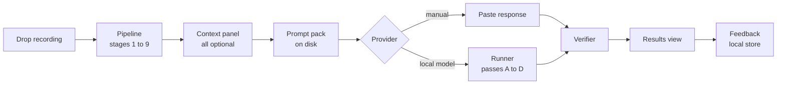
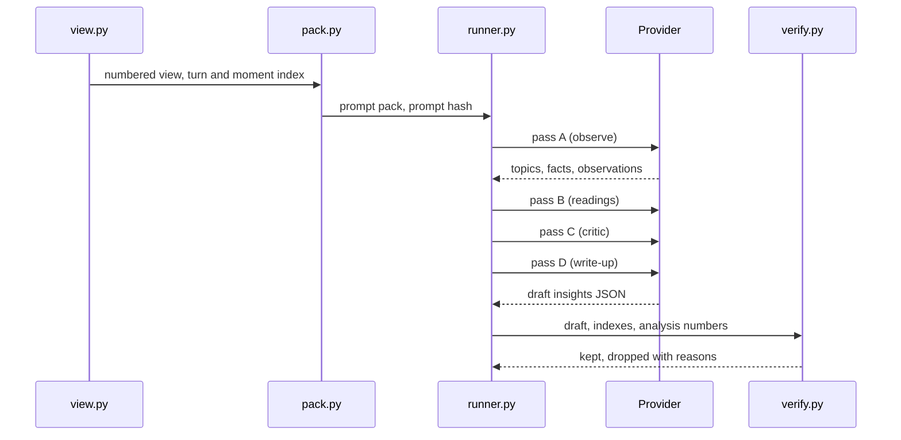

# Melody — PRD and Implementation Plan

2026-09-21 · revised against the code in `D:\Kaden\Python\Revolv` (branch `main`, 11 commits, last commit 2026-09-20 "Footprint and requirements, measured; verbatim pass degrades instead of failing on a small card")

## 1. Handoff summary

This doc specifies the next build of Melody: a local interpretation layer that turns the existing analysis view into notes, evidence-linked readings and self-coaching. Phase 1 makes no network calls. Phase 2 holds every cloud or outside connection. "Melody" is the working name; the product name is an open decision.

The 2026-09-20 draft of this doc was written from `README.md` alone. This revision was written after reading the code, and every statement below about what exists was checked against a file and a function. Where the README and the code disagreed, the code is what is written here. The audit milestone (section 9, A) is therefore mostly done; what remains of it is the part that needs a Windows machine: running the app and `--selftest`.

**What exists today, verified 2026-09-21**

Repository facts the implementing agent needs before touching anything:

- It is a git repository on `main`, 11 commits, working tree clean. A `git status` run from a non-Windows mount reports eight files modified (`prosody.py`, `stance.py`, `tools/train_stance_head.py`, `assets/stance_head.json`, three `.md` docs, `legacy/RevolvTranscriber.spec`); `git diff --ignore-cr-at-eol` is empty, so those are line endings only. `core.autocrlf` is unset and the tree mixes CRLF (`prosody.py`) and LF (`analysis.py`). Keep each file's existing endings; never run a tool that rewrites them.
- There are no tests, no `tests/` folder, no `pytest.ini`, no `pyproject.toml` and no `requirements*.txt`. Dependencies exist only as what is installed in `.venv` (Python 3.13.14, 138 packages). M0 adds the first of each.
- `.venv` already has `PySide6-Essentials 6.11.2` (QtCore, QtGui, QtWidgets, QtNetwork; QtMultimedia is present as `.pyi` stubs only), `av`, `numpy`, `scipy`, `librosa`, `torch`, `transformers`, `onnxruntime`, `pyannote`, `whisperx 3.8.6`, `faster-whisper 1.2.1`, `crisperwhisper 2.0.3`, `ctranslate2 4.8.1`, `nltk`, `requests`, `PyYAML`, `psutil`, `pillow`, `PyInstaller 6.22.3`. It does not have `jsonschema`, `pytest`, `send2trash`, `keyring` or `sounddevice`.
- Real data sits in the folder, gitignored but present: `transcript_output.json` (an August transcript in the pre-verbatim format), `pipeline.log`, `Melody_Voice_Analyzer.zip`. Never read these into fixtures, tests or docs.
- Three planning documents sit at the root: `ANALYSIS_PLAN.md`, `ANALYSIS_REVIEW.md`, `SOTA_REVIEW.md`. None covers interpretation. `ANALYSIS_PLAN.md` §12 deferred editable speaker names; the context panel (FR-1) is where that lands.
- `%LOCALAPPDATA%\MelodyToneAnalyzer\` holds `settings.json` and `melody.log`. `config.app_data_dir()` creates it and migrates the old `RevolvTranscriber` settings on first run.

| Area | Files and entry points | Status | What this plan does with it |
| --- | --- | --- | --- |
| Pipeline stages 1 to 8 | `pipeline.py`: `Transcriber(profile, hf_token, language, diarize, emotion, log, backend, prosody, analyse, model_override, vocabulary, verbatim, stance)`, `.load_models(progress, cancel)`, `.run(path, progress, cancel, trim) -> (segments, meta)`, `.close()`. `asr.py`, `verbatim.py`, `prosody.py`, `stance.py`, `audio.py` (`load_audio`, `probe_duration`), `hardware.py` (`detect() -> HardwareProfile`) | Exists | Read only. No changes to models or thresholds |
| Analysis, stage 9 | `analysis.py`: `analyse(segments, meta, track) -> report`. Pure Python. Real shape in section 7.0 | Exists | Read only. The interpretation layer reads its output |
| Output writers | `writers.py`: `write_json`, `write_md`, `write_txt`, `write_srt`, `write_csv`, `write_analysis`, `write_all(segments, meta, output_dir, stem, formats)`, `unique_path(path)` | Exists | M1 extracts a string renderer from `write_md`; `unique_path` is reused for every new file |
| Main window | `gui.py`: `MainWindow`, `FileRow` (card per file; `activated` signal on double-click reveals the first output), `Job` (`path`, `state`, `outputs`, `row`), `Worker(QThread)` (loads models once, runs the queue, calls `write_all`, emits `jobDone(index, written, meta)`), `HardwareProbe`, `SettingsPanel` (a `Qt.Popup` under the Settings button; applies on close), `DictionaryDialog`, `launch(initial_files)` | Exists | Extended, not replaced. `FileRow` gains row actions; `Worker` gains the pack hook; `SettingsPanel` gains an Interpretation group |
| Theme | `theme.py`: `get(name) -> palette dict`, `qss(palette) -> stylesheet` applied app-wide by `MainWindow.apply_theme`; styling is by `objectName` (`primary`, `quiet`, `row`, `rowStatus`, `sectionLabel`, `sectionCount`, `pill`, `log`, ...) | Exists | New widgets use existing object names where one fits and add rules to `qss()` otherwise |
| Settings | `config.py`: `DEFAULTS`, `Settings(dict)` with `.load()` and `.save()`, `app_data_dir()`, `log_file()`, `settings_file()`, `bundle_dir()`, `MEDIA_EXTENSIONS`, `is_media_file()` | Exists | New keys go into `DEFAULTS`. `load()` copies only keys present in `DEFAULTS`, so a key added anywhere else is dropped on the next launch |
| Logging | `main.py` `_install_logging()` redirects `sys.stdout` and `sys.stderr` to `melody.log` (rotated at 8 MB). `MainWindow.log()` appends to the window pane only. The pipeline's `log` callback reaches the pane through `Worker.log`. No `logging` module anywhere | Exists | `safelog.py` prints one line per event to stdout, and to the pane when given a callback. It never accepts text |
| Selftest and build | `main.py --selftest [clip]`; `build.ps1` (installs `pyinstaller PySide6-Essentials psutil pillow`, seeds the HF token, runs the spec); `MelodyToneAnalyzer.spec` (onedir, `console=False`, `collect_all` per package, explicit `excludes` including `PySide6.QtMultimedia`); `runtime_hook.py` (sets `MPLBACKEND`, `HF_HUB_DISABLE_TELEMETRY`, `KMP_DUPLICATE_LIB_OK`) | Exists | M11 extends. `selftest` prints the first 80 characters of the transcript into the log, which PR-4 forbids; M11 changes it to a count |
| Hardware and VRAM | `hardware.py`: `HardwareProfile` (`device`, `device_name`, `vram_gb`, `model_size`, `compute_type`, ...). The verbatim model is parked on the CPU between files; `Transcriber.close()` frees everything and calls `torch.cuda.empty_cache()` | Exists | Used as is; M9 starts interpretation only after `close()` |
| `legacy/` | The 2026-09-09 pipeline | Exists | Not touched |
| Tests | none | Missing | M0 |
| Interpretation layer | context capture, numbered view, prompt pack, verifier, results view, audio playback, timeline, feedback store, coaching, retention, benchmark harness, net guard, safe logging | Missing | Confirmed by grep: nothing in `revolv/` mentions insights, prompts, interpretation, context files or speaker names |

**Conflicts between the earlier draft and the code, and how they are settled**

1. **Moments are per turn.** `analysis.select_moments` yields one moment per flagged turn, carrying an `evidence` list with one entry per note (feature, wording, z, n) plus any pause notes. The earlier draft gave every note its own id. This draft gives each moment one id (`M017`) and lets the model cite that; the verifier looks up which notes it carries. Section 7.2 shows the format.
2. **There is no audio playback stack.** `PySide6-Essentials` does not ship QtMultimedia and the spec excludes it. Click-to-play needs either `PySide6-Addons` or PyAV decoding plus `sounddevice`. Decision D9; the plan recommends the second.
3. **`.analysis.json` exists only when both `md` and `json` are on.** `write_all` writes it as the sibling of the `.md` when JSON is also requested, and the writers serialise `meta["analysis"]`, which the pipeline computed with the audio in hand. In the app the prompt pack is built from the in-memory `meta` straight after `write_all`, before `jobDone` fires. The CLI needs `<name>.json` and `<name>.analysis.json`; if the second is missing it re-analyses through `analysis.analyse` without a prosody track and says in the pack that no pitch or energy notes were available.
4. **Word kinds** written by the verbatim merge are `filler`, `vocalisation`, `event`, `cutoff` and `repetition`. Restarts are tagged `repetition` (see `verbatim._is_repetition`). Ordinary words carry no `kind`. Where this doc says "restarts and cut-offs" it means `repetition + cutoff`.
5. **Turn indexes are 0-based** (`turn["index"]`). `T001` is index 0.
6. **File naming with a double suffix.** `unique_path` treats `call.insights.json` as stem `call.insights`, so a second run writes `call.insights (2).json`, exactly as `call.analysis (2).json` happens today. Accepted.
7. **Where settings live in the UI.** Output folder and the format chips are on the main window; everything else is in the Settings popover. The Interpretation controls go in the popover, under the existing checkboxes.
8. **The window log already shows source file names** (`Worker.run` logs `job.path.name` and every saved path). That stays. PR-4 binds new code only; decision D10 records whether the owner wants the existing lines changed too.
9. **`HF_HUB_DISABLE_TELEMETRY` is already set**, but only in the frozen build's `runtime_hook.py`. `HF_HUB_OFFLINE` and `TRANSFORMERS_OFFLINE` are set nowhere. `netguard.apply_offline_env()` is called from `main.py` so source runs and bundles behave alike.
10. **Stage numbering.** The README's layout table calls `analysis.py` "Stage 7"; its pipeline section calls analysis the ninth step. This doc says stage 9 and the interpretation layer is stage 10.

**What this build adds**

- A context panel designed to be left empty: meeting type, goal, names, and "Which one is you?".
- A prompt pack written to disk for every recording, so any model can be used by hand or through an adapter.
- A deterministic verifier that checks quotes, moment ids, convergence and wording in code.
- A results view: Notes, Under the surface, a per-speaker timeline with click-to-play, and measured speaker facts.
- "How you sounded": perceived-delivery coaching for the user's own voice, against their own past calls.
- Local feedback capture that doubles as evaluation data.
- A benchmark harness that compares models and prompt versions on the same calls.

**Can the interpretation step be written down as prompts? Yes.** It is one model called four times with four fixed prompts, not several different models. Passes B to D have slots the app fills with the previous pass's JSON, so by hand that means four paste round trips. The pack therefore also carries a single-pass prompt for hand use: one paste in, one paste out. The mechanical half of the critic runs in code in both modes, so either route gives the same guarantees on what reaches the screen. All prompts are in section 8.

**Rules for the implementing agent**

1. Read `README.md`, `revolv/analysis.py`, `revolv/writers.py`, `revolv/gui.py`, `revolv/config.py` and `revolv/pipeline.py` before writing code. Section 7.0 records the shapes found on 2026-09-21; the pipeline is still moving, so re-check any key against the code before relying on it and record what you find in `docs/DATA_NOTES.md`.
2. Keep the README's contract: the pipeline describes evidence, never verdicts. Interpretation lives only in the new layer.
3. Add no network call in Phase 1. Every URL the new code touches must pass `revolv/netguard.py`.
4. Never overwrite an output. Use `writers.unique_path` for every new file.
5. Never commit real recordings, transcripts or insights. Tests use synthetic fixtures only. The three real files at the repo root stay unread.
6. Keep transcript text and insight text out of `melody.log` and the window log. New code logs ids, counts and durations through `safelog.py`.
7. Build milestone by milestone in section 9. Each ends with tests that must pass before the next starts.
8. Stop and ask the owner on the decisions in section 12. Do not pick silently.
9. Preserve each file's line endings. Do not reformat files you did not otherwise change.
10. New settings keys go into `config.DEFAULTS`, nowhere else.

**Terms**

| Term | Meaning |
| --- | --- |
| Turn | One speaker's stretch of talk, as `analysis.build_turns` builds it. Gets an id `T001` in the model view |
| Moment | One turn that departed from its speaker's own baseline, as `analysis.select_moments` builds it. Carries one or more notes. Gets an id `M001` |
| Note | One entry in a moment's `evidence` list: a feature, its wording, z and n. Pause notes ("pauses for 2.4s") sit beside them in `observations` |
| Channel | Kind of evidence: lexical, timing, prosody, disfluency, interaction |
| Reading, insight | A hypothesis about a speaker at a moment or topic, with evidence and alternatives |
| Lens | The short block that tells the model what matters for this meeting type |
| Me-speaker | The diarized speaker the user marked as themselves |
| Prompt pack | The folder of ready-to-send prompts for one recording |

## 2. Product: problem, users, goals

Notetakers summarise words and discard tone, timing and hesitation, so they cannot say what a speaker cared about or held back. Melody already measures those signals. Nothing yet reads them and hands the user something they can act on.

**Users.** The Phase 1 user is the owner, reviewing their own recorded calls on a Windows PC with an NVIDIA GPU. The later buyer is anyone who reviews high-stakes conversations: founders, investors, sales leads, negotiators, researchers.

**Goals for Phase 1**

| # | Goal | How it shows up |
| --- | --- | --- |
| G1 | Notes as clean as Granola's from an empty notes pane | Notes tab: summary, decisions, action items, open questions, key numbers |
| G2 | Readings the user can check | Up to 8 per call, each with quotes, timestamps, alternatives, a likelihood word, a follow-up question and click-to-play |
| G3 | Self-coaching on perceived delivery | "How you sounded" for the me-speaker only |
| G4 | Private by architecture, and provably so | No egress in Phase 1; an automated offline test |
| G5 | Model-agnostic | One provider interface; prompts versioned; every run recorded |
| G6 | Feedback that becomes evaluation data | Three feedback kinds stored locally |

**Non-goals for Phase 1**

- Live capture of calls. The app keeps working from dropped files.
- Any cloud call, account, sync, sharing or telemetry.
- Scores about other people. No confidence, opaqueness or sentiment number for anyone but the me-speaker.
- Voice profiles or baselines for other speakers that persist across recordings.
- Lie detection, or any wording that implies it.
- Use in hiring, firing or performance decisions.
- Licensing changes to pipeline models. See risks in section 12.
- Changes to pipeline thresholds. `NOTABLE_SIGMA` and friends stay where the README left them.

**Product principles.** These settle arguments during the build.

1. **Evidence, not verdicts.** Every reading shows the words and the moment it rests on, and the user can replay it.
2. **Moments, not traits.** About other people, the product says where something happened, never what kind of person they are.
3. **Convergence before claims.** One acoustic cue is never enough. Two kinds of evidence, one of them from the words or the interaction.
4. **Abstaining is a good answer.** "Nothing notable" is a normal result and is shown without apology.
5. **Code checks what code can check.** Quotes, ids, counts, caps and banned wording are verified deterministically, not trusted to the model.
6. **Designed for an empty notes pane.** Every input is optional. Salience comes from the conversation itself and from one-click signals.
7. **Numbers only where they are measured.** Talk share is a number. A reading is a likelihood word.

## 3. Experience and functional requirements

The user drops a recording, optionally answers three one-click questions, and gets notes plus a short list of readings they can replay. Nothing in the flow requires typing.



The verifier sits between every model and the screen, whichever route produced the response.

**Where it attaches to the existing window.** A `FileRow` today shows the file name, a percent, a status line and a 4 px progress bar, and reveals the first output in Explorer on double-click. Once a job is `done`, the row gains two quiet buttons on its right: **Context** and **Results**. Both open windows of their own (`gui_context.py`, `gui_results.py`); the main window stays the queue. The status line keeps its "double-click to open" wording.

### Context capture

| ID | Requirement | Done when |
| --- | --- | --- |
| FR-1 | A context panel per recording with meeting type (8 options), a one-line goal, speaker names, typed notes. All optional. Saved as `<name>.context.json` | Interpretation runs with every field empty |
| FR-2 | "Which one is you?" plays a 3-second clip per speaker with at least 5 s of talk, taken from that speaker's longest turn that no `overlap_events` entry touches | One click sets `me`; can be changed later |
| FR-3 | After interpretation, detected topics appear as chips. Tapping marks a topic important and re-runs only the write-up | Re-rank takes no re-transcription and keeps the earlier run |
| FR-4 | A consent line in the panel: "Everyone on this recording knew it was being recorded" (yes, no, not sure). Advisory in Phase 1 | Stored in context; shown in the run record |

### Interpretation

| ID | Requirement | Done when |
| --- | --- | --- |
| FR-5 | Prompt pack export to `<name>.prompt/`: shared brief, numbered analysis view, pass templates, single-pass prompt, JSON Schemas, a README on how to use it by hand | Pack is produced with no model configured |
| FR-6 | Response import: paste or load a model's JSON; code fences are stripped; schema errors are shown in plain words | A valid single-pass response yields `.insights.json` and `.notes.md` |
| FR-7 | Verifier, in code: schema, quote match, moment-id match, convergence, timing guard, likelihood cap, banned wording, caps per speaker and per call | Every dropped item is recorded with its reason |
| FR-8 | Abstention: a speaker or a whole call may have zero readings | UI shows "Nothing notable" as a normal state |
| FR-9 | Runs never overwrite. Each writes a run record: provider, model, prompt version and hash, parameters, timings, token counts, verifier counts | Two runs on one call sit side by side |

### Results view

| ID | Requirement | Done when |
| --- | --- | --- |
| FR-10 | Notes tab: summary of 3 to 5 sentences, decisions, action items with owner and due date, open questions, key numbers. Each line links to its turn | Clicking a line scrolls the transcript and cues the audio |
| FR-11 | Under the surface tab: cards grouped by speaker. Each card shows claim, likelihood word, evidence strength, evidence chips, alternatives, follow-up question, play button. Alternatives are visible by default | No numbers or gauges on cards |
| FR-12 | Timeline: one lane per speaker with `baseline_turns > 0`. Ticks at moments, coloured by family (pace, pitch, energy, hesitation, silence). Pins where a kept reading sits | Click plays from 1.5 s before the turn to its end |
| FR-13 | Speaker facts, measured only: talk-share bar, turns, median reply, articulation rate, floor-takes and backchannels, questions asked | No score of any kind for non-me speakers |
| FR-14 | Transcript pane synced to playback, current turn highlighted, speaker names applied | Seeking in either place moves the other |
| FR-15 | Missing media file: playback controls disabled with a one-line reason; everything else works | No crash, no blank view |

### How you sounded (me-speaker only)

| ID | Requirement | Done when |
| --- | --- | --- |
| FR-16 | A components table for this call against the user's own history: mid-sentence fillers, hedges, pace, pauses, restarts, closing pitch on statements, pitch range, reply time | Each row shows this call, usual, and direction |
| FR-17 | A single ring, "steadier than N% of your past calls", appears only after 8 stored calls. Before that: "Building your baseline, n of 8" | Ring never shows for other speakers |
| FR-18 | Per-topic contrast: "most assured on", "least assured on", from own-baseline departures grouped by topic span | Each links to a replayable turn |
| FR-19 | Baseline store holds features only. No audio, no embeddings. A reset button clears it | Reset leaves recordings untouched |

### Feedback

| ID | Requirement | Done when |
| --- | --- | --- |
| FR-20 | On every card: Useful, Not useful, Bad evidence (wrong speaker, wrong quote, wrong moment, other) | One click, undoable |
| FR-21 | Deferred outcome: 7 days later, or when another call with the same named person is opened, ask "Did this turn out to be real?" Yes, No, Still don't know | Asked at most once per reading per week |
| FR-22 | Self labels on me-speaker moments: "Were you unsure here?" Yes, No, Not sure | Stored apart from usefulness votes |
| FR-23 | All feedback in a local SQLite file. A content-free CSV export: layer, channels, likelihood, outcome | Export contains no words from any call |

### Retention

| ID | Requirement | Done when |
| --- | --- | --- |
| FR-24 | Setting with three modes: keep source audio; keep flagged clips only (10 s either side of each kept reading, written to `<name>.clips/`); keep no audio | In clip mode playback works from clips after the source is gone |
| FR-25 | The app never deletes a source recording on its own. "Remove source recording" is an explicit button that sends it to the Recycle Bin after a confirm | No silent deletion path exists |
| FR-26 | "Delete everything derived" per recording: context, prompt pack, insights, notes, clips, feedback rows, baseline row | One action, one confirm |

## 4. Privacy, consent and safety requirements

Phase 1 sends nothing off the machine, and the build must be able to prove it. The legal exposure in this category attaches to capture without consent and to vendors who receive conversations, not to keeping audio. This section is design input, not legal advice; a privacy lawyer should review before anyone outside the owner uses the app.

**Why these rules.** Courts let wiretap, CIPA and BIPA claims proceed against Otter in August 2026 because it allegedly keeps conversations and uses them for its own models ([Recording Law](https://www.recordinglaw.com/news/otter-ai-wiretap-lawsuit-explained/)). Granola was sued in July 2026 although it states it saves no audio; the claims rest on running with no notice to participants ([Barnes & Thornburg](https://btlaw.com/en/insights/alerts/2026/what-the-granola-class-action-means-for-companies-building-and-deploying-conversation-capture-tools)). Both are pleading-stage allegations.

**What the code already does.** `analysis._vader_analyzer` never downloads, by design and by comment. The frozen build sets `HF_HUB_DISABLE_TELEMETRY=1` in `runtime_hook.py`. Nothing in `revolv/` opens a socket of its own; the only network use is HuggingFace model downloads on the first run, inside `pipeline.load_models` and `verbatim.VerbatimPass`.

| ID | Requirement | Done when |
| --- | --- | --- |
| PR-1 | No network egress from any new code path in Phase 1. Provider URLs must resolve to loopback | `tests/test_offline.py` fails on any non-loopback connect during a full run |
| PR-2 | After models are cached, the app sets `HF_HUB_OFFLINE=1`, `TRANSFORMERS_OFFLINE=1`, `HF_HUB_DISABLE_TELEMETRY=1` at start-up, from `main.py` so source runs match the bundle. Setting `offline_mode`, default on once the cache is complete | A run with the network adapter disabled completes |
| PR-3 | `tools/verify_offline.ps1` documents and applies Windows Firewall outbound-block rules for the app and any local model server, and prints how to confirm them | Owner can run one script and see both rules |
| PR-4 | Log hygiene for new code: no transcript text, quotes, claims, names or goals in `melody.log` or the window pane. Ids and counts only | A test greps the log for canary phrases from the fixture |
| PR-5 | No analytics, crash reporting or update checks | Dependency review lists none |
| PR-6 | Banned wording in any text shown to the user: lying, liar, lie, deceptive, deceiving, dishonest, hiding, concealing, manipulative, evasive person. Code rewrites are not attempted; the reading is dropped and the reason recorded | Unit test over the list |
| PR-7 | Likelihood cap: readings in layers stance, unsaid and relational may show at most "very likely"; "almost certain" is not in the vocabulary | Verifier test |
| PR-8 | No numeric score about any non-me speaker anywhere in the UI or files | UI review checklist item |
| PR-9 | Speaker embeddings from diarization are never written to disk by new code. No cross-recording profile for non-me speakers. Today `meta["diarization"]` holds only start, end and label rows and is not serialised; keep it that way | Code review item; grep for embedding persistence |
| PR-10 | The me-speaker baseline stores numeric features per call, with date and call id. No audio, no embeddings, no text | Schema test |
| PR-11 | Consent line (FR-4) stored with each recording. Benchmark harness refuses to send a call to any remote provider unless `consent.cloud_ok` is true | Harness test in section 10 |
| PR-12 | Feature flag `subtext_enabled`. Off hides the Under the surface tab and skips passes B and C, leaving notes and self-coaching | One setting, covered by a test |
| PR-13 | Retention modes and delete paths as FR-24 to FR-26 | Tests on a temp directory |
| PR-14 | Insight files are as sensitive as the recording. They are written only beside the source or in `output_dir`, never to temp or cache folders. (`selftest` writes to `%TEMP%\revolv_selftest`; that is pipeline output on a synthetic clip and stays as it is) | Code review item |

**Why PR-12 exists.** The EU AI Act restricts inferring emotions or intentions of people at work, outside medical or safety uses. The flag lets a future build ship notes and self-coaching alone where that applies. Scope and wording need counsel before any EU distribution.

**Consent when live capture arrives (not Phase 1).** Notice must be on by default: a chat line pasted into the call, a scripted sentence for the user to say, and the opening seconds kept as evidence of agreement. Record this now so the capture design does not inherit Granola's defaults.

## 5. Success metrics and release criteria

Phase 1 is done when the owner can run ten of their own calls end to end offline and would rather read Melody's output than their own notes. The targets below are starting proposals; none has been measured yet, and the benchmark harness exists to replace them with real figures.

**Guarantees, true by construction**

- Every reading on screen has at least one quote that string-matches its turn, and meets the convergence rule.
- No reading on screen uses banned wording or exceeds the likelihood cap.
- Zero non-loopback connections during interpretation.

**Targets to measure**

| Metric | Target | Measured by |
| --- | --- | --- |
| Action-item recall against the owner's hand list | 90% or more on 5 calls | Manual check, recorded in `bench/` |
| Readings marked Useful | 50% or more across 10 dogfood calls | Feedback store |
| Readings marked Bad evidence | 10% or less | Feedback store |
| Proposed evidence items the verifier rejects for quote mismatch | Under 5% for the default model | Run records |
| Test-retest, 5 runs on one call: overlap of reading keys | Jaccard 0.6 or more | Harness |
| Test-retest: matched readings within one likelihood band | 80% or more | Harness |
| Interpretation time for a 30-minute call, local model, RTX 5060 Ti | 5 minutes or less | Run records |
| Prompt pack size for a 30-minute call, single pass | 14,000 tokens or less in. The `.md` alone is about 8,300 to 8,600 tokens on the README's sample calls | Pack builder |

**Release checklist for Phase 1**

- [ ] All milestone acceptance tests in section 9 pass
- [ ] Offline test passes with the network adapter disabled
- [ ] Ten calls processed end to end by the owner, feedback recorded
- [ ] Both ablations run and written up: annotated against plain, verbatim against clean
- [ ] One benchmark report comparing at least two local models
- [ ] `--selftest` extended to cover pack build, verifier and store
- [ ] Owner decisions in section 12 answered and recorded in `docs/DECISIONS.md`

## 6. Architecture

Interpretation is a tenth stage that reads the pipeline's files and never touches audio or models from stages 1 to 8. It is split so that the model does the reading and code does the checking, and so that the model behind it can be swapped by changing one setting.



In single-pass or manual mode the four model calls collapse into one; everything from `verify.py` onward is identical.

### Where the inputs come from

The interpretation layer needs two things the pipeline already produces: the segments (the `.json`: words with timings, speakers and `kind`) and the analysis report (`meta["analysis"]`, serialised as `.analysis.json`: turns, moments, baselines, overlaps). The report's turns carry no words (`analysis._public` strips `segments`), so word kinds and word timings come from the segments, matched to turns by index. `analysis.build_turns(analysis.split_segments_by_speaker(segments))` is deterministic and reproduces the report's turns with their segments attached, which is how `view.py` gets both without re-running the analysis.

Two entry points, one code path:

- **In the app.** `Worker.run` already has `segments` and `meta` in hand after `write_all`. The pack hook runs there, before `jobDone` is emitted, so it never re-reads files and never needs `.analysis.json` to exist.
- **From disk.** `python -m revolv.interpret pack <name>.json` looks for `<name>.analysis.json` beside it. If it is missing, it calls `analysis.analyse(segments, {"source": ..., "media_seconds": ...})` with no track, which yields turns, pauses, disfluency and timing but no pitch or energy notes, and the pack's `pack.json` records `"prosody": false`.

### Division of labour

| Code does | The model does |
| --- | --- |
| Turn ids, moment ids, millisecond offsets | Topics and who raised them |
| Talk share, reply times, overlap counts, questions asked | Lexical and pragmatic reading: hedges, commitment strength, non-answers, topic shifts |
| z-scores and n, copied from the report by moment id | Competing readings and ordinary alternatives |
| Quote matching, channel counting, timing guard, caps, banned wording | Tentative wording, follow-up questions, notes |
| Delivery features and the me-speaker composite | Three coaching sentences from those numbers |

### New modules

| Path | Role |
| --- | --- |
| `revolv/writers.py` (existing) | M1 adds `render_md(report, meta, numbered=False) -> str`; `write_md` becomes a thin wrapper that calls it and writes through `unique_path` |
| `revolv/interpret/__init__.py`, `__main__.py` | Package and the `pack` / `import` / `run` CLI |
| `revolv/interpret/view.py` | `build(report, segments, meta) -> View`: the numbered text plus a turn index and a moment index |
| `revolv/interpret/context.py` | Load, save, validate `<name>.context.json` |
| `revolv/interpret/prompts/` | `brief.md`, `pass_a.md`, `pass_b.md`, `pass_c.md`, `pass_d.md`, `single_pass.md`, `coaching.md`, `lenses/*.md`. Each file has a version line |
| `revolv/interpret/pack.py` | Fills slots, writes `<name>.prompt/`, computes `prompt_sha256` |
| `revolv/interpret/schema.py` | JSON Schemas for pass outputs and for `insights.json` |
| `revolv/interpret/verify.py` | The deterministic verifier and its constants |
| `revolv/interpret/runner.py` | Runs passes over a provider, retries once on schema failure, writes the run record |
| `revolv/interpret/providers/base.py` | The provider protocol below |
| `revolv/interpret/providers/manual.py` | Writes the prompt, accepts a pasted or loaded response |
| `revolv/interpret/providers/openai_compat.py` | Any OpenAI-compatible endpoint. Loopback only in Phase 1 |
| `revolv/netguard.py` | `assert_loopback(url)`, `apply_offline_env()` |
| `revolv/safelog.py` | `log_event(name, **fields)`, ids and numbers only |
| `revolv/player.py` | Decode and play a time range of the source or a clip; position signal for the transcript. Backend per D9 |
| `revolv/coaching.py` | Delivery features, composite, topic contrast |
| `revolv/store.py` | SQLite: feedback, outcomes, self labels, me-baseline |
| `revolv/retention.py` | Clip export, remove source, delete derived |
| `revolv/gui_context.py` | The context window (FR-1 to FR-4) |
| `revolv/gui_results.py`, `revolv/widgets/timeline.py` | Results window and the timeline widget |
| `revolv/assets/hedges.txt` | The hedge list for `coaching.py`, packed as data |
| `bench/` | Harness, section 10 |
| `tests/` | pytest; `conftest.py` blocks non-loopback sockets |
| `tools/start_local_llm.ps1`, `tools/verify_offline.ps1` | Helper scripts |
| `docs/DATA_NOTES.md`, `docs/DECISIONS.md` | What the agent found; what the owner decided |

### How the new code fits the existing window

- **Threads.** The pipeline runs in `Worker(QThread)` and talks to the window only through signals. Interpretation over a local model runs the same way: a `InterpretWorker(QThread)` per batch, started from `_on_all_finished` after the pipeline worker has exited (which is when `Transcriber.close()` has run). Pack building is fast and runs inside `Worker.run` itself.
- **Theme.** `MainWindow.apply_theme` sets the stylesheet on the `QApplication`, so every new window inherits it. Use the object names `theme.qss` already styles (`primary`, `quiet`, `row`, `rowName`, `rowStatus`, `rowBar`, `sectionLabel`, `sectionCount`, `pill`, `pillText`, `pillMeta`, `log`, `statusLine`, `popover`, `card`, `chip`, `chipMinor`) where the geometry fits, and add new rules to `qss()` for what is new (insight cards, evidence chips, timeline lanes) rather than stretching `#card` and `#chip`, whose sizes are tuned for the queue and the format row. The palette dict from `theme.get()` is what custom-painted widgets (the timeline) read colours from, the way `WaveBadge` and `DropZone` do.
- **Settings.** `SettingsPanel.__init__` builds the popover; `apply()` copies widget state into `window.settings` and saves. Add an "Interpretation" group after the pipeline checkboxes: interpret on/off, subtext on/off, provider, base URL, model, retention mode. Keep the popover's habit of applying on close.
- **Logging.** `Worker.log` is a `Signal(str)` into the pane. `safelog.log_event` formats `"[melody] pack_built call=... turns=... tokens=..."` and prints it (stdout is `melody.log` under the app) and, when handed a callback, sends it to the pane as well. Nothing else in new code prints.
- **Row actions.** `FileRow` gets `set_actions(context_cb, results_cb)`, shown when `set_state("done", ...)` is called. `Job` gets `context_path`, `pack_dir`, `insights_path`.

### Provider interface

```python
# revolv/interpret/providers/base.py
from dataclasses import dataclass, field
from typing import Literal, Protocol

@dataclass(frozen=True)
class Completion:
    text: str
    tokens_in: int | None
    tokens_out: int | None
    seconds: float
    model: str
    provider: str
    raw: dict = field(default_factory=dict)  # never logged

class Provider(Protocol):
    id: str                                   # "manual", "openai_compat", ...
    egress: Literal["none", "loopback", "remote"]

    def complete(self, *, system: str, user: str,
                 json_schema: dict | None,
                 temperature: float, seed: int | None,
                 max_tokens: int) -> Completion: ...
```

Rules: the runner refuses any provider whose `egress` is `remote` unless Phase 2's `allow_remote` setting is on. `openai_compat` calls `netguard.assert_loopback` on its base URL at construction. Structured output uses `response_format` with a JSON Schema where the endpoint supports it, otherwise plain JSON plus validation and one retry that quotes the validation error. HTTP goes through `urllib.request` from the standard library; `requests` is in the environment only as a transitive dependency of the model stack and is not relied on.

### VRAM sequencing

A local model and the pipeline cannot share 16 GB: the README measures the pipeline's peak at 11.3 GB during the verbatim pass, and a 14B model at 4-bit wants 9 GB or more on its own. Interpretation for a batch starts only after the pipeline `Worker` has finished and `Transcriber.close()` has released the GPU. The app does not manage the model server in Phase 1; it connects to an endpoint the user started with `tools/start_local_llm.ps1`, and that server must be started after the pipeline batch ends or on a second card. Context length must be 32,768 or more.

### Audio playback (D9)

The spec excludes QtMultimedia and `PySide6-Essentials` does not ship it, so `QMediaPlayer` is not available without adding `PySide6-Addons`. The recommended path uses what is already there: `audio.load_audio(path)` decodes any container PyAV opens to mono 16 kHz float32 (a 30-minute call is about 115 MB in memory, decoded once per results window in a thread), and `sounddevice` plays a slice through an `OutputStream` whose callback reports position for FR-14. Clips in `<name>.clips/` are FLAC written and read by PyAV. The same module plays the "Which one is you?" samples. If the owner prefers `PySide6-Addons`, `player.py` is the only file that changes.

### New settings (`config.DEFAULTS`)

| Key | Default | Meaning |
| --- | --- | --- |
| `interpret` | `true` | Build the prompt pack after analysis |
| `interpret_mode` | `single_pass` | `single_pass` or `multi_pass` |
| `provider` | `manual` | `manual` or `openai_compat` |
| `provider_base_url` | `http://127.0.0.1:8080/v1` | Must resolve to loopback in Phase 1 |
| `provider_model` | `""` | Model name sent to the endpoint |
| `subtext_enabled` | `true` | PR-12 |
| `offline_mode` | `true` | PR-2 |
| `retention` | `keep_source` | `keep_source`, `clips`, `none` |
| `max_insights_per_call` / `max_insights_per_speaker` | 8 / 3 | Verifier caps |
| `me_baseline_min_calls` | 8 | Calls before the ring appears |

Every key goes into `DEFAULTS` in `config.py`; `Settings.load` ignores anything else. Existing keys are untouched.

### Verifier constants (`revolv/interpret/verify.py`)

| Constant | Default | Effect |
| --- | --- | --- |
| `MIN_CHANNELS` | 2 | Distinct evidence kinds a reading needs |
| `REQUIRE_NONACOUSTIC` | `True` | One channel must be lexical or interaction |
| `QUOTE_MAX_WORDS` | 25 | Longer quotes are rejected |
| `TIMING_MIN_GAP_SECONDS` | 2.0 | A reply gap below this is not timing evidence |
| `TIMING_MEDIAN_MULTIPLE` | 3.0 | The gap must also be this many times the speaker's `median_reply_latency` |
| `IN_TURN_PAUSE_SECONDS` | 2.0 | An in-turn pause at or above this counts as timing evidence |
| `MIN_TURNS_FOR_READINGS` | `analysis.MIN_TURNS_FOR_BASELINE` (12) | A speaker with fewer scored turns gets no readings |
| `PLAY_LEAD_SECONDS` | 1.5 | Playback starts this far before the turn |
| `CLIP_PAD_SECONDS` | 10 | Padding each side of a kept clip |

### Files written per recording

| File | Written by | Contents |
| --- | --- | --- |
| `<name>.context.json` | Context window | Section 7.1 |
| `<name>.prompt/` | `pack.py` | Prompts, numbered view, schemas, how-to |
| `<name>.insights.json` | Runner or import | Notes, speakers, readings, dropped items, run record |
| `<name>.notes.md` | Runner or import | The Notes tab as Markdown, for pasting elsewhere |
| `<name>.clips/` | `retention.py` | Only in `clips` mode |

All of them go beside the source or into `output_dir`, exactly where `Worker.run` puts the pipeline's files today (`Path(self.output_dir) if self.output_dir else job.path.parent`).

## 7. Data contracts

Five contracts hold the design together: the pipeline's own outputs as they really are, the context file, the numbered view the model reads, the insights file the UI renders, and the local store. The model never writes a number that code already knows; it cites ids and code fills the figures in.

### 7.0 What the pipeline writes today (verified against `pipeline.py` and `analysis.py`)

**Segments** (`<name>.json`, a bare list, the same shape `writers.write_json` has always written):

```json
{"start": 429.3, "end": 433.1, "speaker": "SPEAKER_02",
 "text": "uh That makes a ton of sense.",
 "words": [{"word": "uh", "start": 429.3, "end": 429.5, "speaker": "SPEAKER_02", "kind": "filler"},
           {"word": "That", "start": 429.6, "end": 429.8, "speaker": "SPEAKER_02"}],
 "pacing": {"word_count": 6, "duration_seconds": 3.8, "wpm": 94.7},
 "emotion": {"valence": 0.52, "arousal": 0.41, "dominance": 0.44, "measured_over": [429.3, 441.0]},
 "stance": {"certainty": -0.03, "probabilities": {"confident": 0.1, "nervous": 0.1},
            "measured_over": [429.3, 441.0]}}
```

`kind` is absent on ordinary words and otherwise one of `filler`, `vocalisation`, `event`, `cutoff`, `repetition`. `speaker` on a word comes from the exclusive diarization; the segment's own `speaker` is what `split_segments_by_speaker` has already reconciled. `emotion` and `stance` appear only on turns clearing the four-second gate and are repeated across that turn's segments; `emotion` may also carry `raw` and `clipped` when the model left the unit range. Timestamps are in original-media seconds even when `trim` was used.

**Report** (`meta["analysis"]`, serialised unchanged as `<name>.analysis.json`):

```text
summary        media_seconds, turns, speakers, speech_seconds, speaker_changes,
               seconds_between_changes, longest_turn{speaker,start,seconds},
               scored_turns, emotion_gate_seconds, emotion_scope
speakers       {label: {turns, scored_turns, speech_seconds, talk_share,
                        median_turn_seconds, median_reply_latency, articulation_wpm,
                        baseline_turns,
                        # present only when scored_turns >= MIN_TURNS_FOR_BASELINE:
                        arousal, valence, articulation, f0_range, loudness_sd,
                        terminal_rise, intensity_onset, intensity_mid, certainty,
                        medial_fillers, lexical   -> each {median, scale, mad, n} or null}}
moments        [{turn: <0-based turn index>, start, speaker,
                 observations: [str], voice_observations: [str],
                 evidence: [{feature, note, z, n}],       # mismatch adds arousal_z
                 baseline: "call" | "trailing", mismatch: bool, preview: <80 chars>}]
turns          [{index, speaker, start, end, text, speech_seconds, word_count,
                 reply_latency | null,                     # null unless the speaker changed
                 pauses: [{at, seconds, within_segment, after_word, before_word}],
                 pace: {word_count, speech_seconds, wpm, articulation_wpm},
                 emotion: {arousal, valence?} | null,
                 stance: {certainty, probabilities} | null,
                 lexical: float,
                 disfluency: {filled_pauses, initial, medial, final, repetitions, cutoffs,
                              vocalisations, per_100_words, medial_per_100_words, events?} | null,
                 prosody: {f0_median_hz, f0_range_semitones, f0_terminal_rise, loudness_db_sd,
                           voiced_fraction, intensity_onset_db?, intensity_mid_db?, intensity_words?} | null}]
settings       turn_break_seconds, emotion_min_speech, pause_min_seconds, notable_sigma,
               mismatch_sigma, min_turns_for_baseline, split_min_words, split_min_seconds,
               baseline_estimator, trailing_baseline_turns, lexical_source, pitch_tracker
audio_coverage {audio_seconds, transcript_seconds, turns_within_audio, turns_total, complete, audio_starts_at?}   # only with a track
overlap        {count, seconds, share_of_speech, seconds_per_speaker, longest,
                backchannels, floor_taking, floor_taking_by_speaker, rule}      # only with diarization
overlap_events [{start, end, seconds, speakers: [a, b], by, over, kind: "backchannel" | "floor_taking"}]
```

Moment features are `articulation`, `arousal`, `f0_range`, `loudness_sd`, `terminal_rise`, `certainty`, `medial_fillers` and `mismatch`; the wording for each is in `analysis._NOTES`. `disfluency` is `null` on a transcript that did not go through the verbatim pass. `preview` is the only transcript text in the report, and the view never uses it.

**Meta** (in memory only; the writers serialise nothing of it but `analysis`): `source`, `media_seconds`, `language`, `segments` (count), `speakers` (count), `backend`, `verbatim` (bool), `model`, `device`, `device_name`, `compute_type`, and when present `verbatim_model`, `verbatim_merge`, `verbatim_tokens`, `stance_head`, `stance_scored_turns`, `emotion_scope`, `emotion_scored_turns`, `trimmed_from`, `trimmed_to`, `diarization` (rows of `start`, `end`, `speaker`), `overlaps`, `overlap_seconds`, `pitch_tracker`, `analysis`.

**The `.md`** is written by `writers.write_md` from the report: title line (`<source stem> - <min> min - <speakers> speakers - <turns> turns`), `LEGEND` with the gate, sigma and trailing-window sentence filled, the verbatim and stance paragraphs when they apply, `## Participants` table, the overlap sentence, `## Moments` (one line per moment, `- mm:ss SPEAKER - note (z +1.7, n 27); pauses for 2.4s`), and `## Transcript` (`(...5.7s silence)` lines for gaps of 2 s or more, then `[mm:ss] SPEAKER (notes): text` with in-turn pauses marked by `_turn_body`).

### 7.1 `<name>.context.json`

```json
{
  "schema_version": "1.0",
  "meeting_type": "investor_pitch",
  "goal": "",
  "me": "SPEAKER_00",
  "speaker_names": {"SPEAKER_00": "Me", "SPEAKER_02": "Brian"},
  "important_topics": [],
  "notes": "",
  "consent": {"all_parties_knew": "yes", "cloud_ok": false}
}
```

`meeting_type` is one of `investor_pitch`, `sales_discovery`, `negotiation`, `one_on_one`, `job_interview`, `user_research`, `team_decision`, `other`. `me` may be null. `all_parties_knew` is `yes`, `no` or `not_sure`. Every field has a valid empty value.

### 7.2 The numbered model view

`view.py` renders the same content as the `.md`, with ids added, through the shared `render_md(report, meta, numbered=True)`. It is built from the report, not by parsing the `.md`, so offsets are exact. Turn ids are `T` plus the 0-based turn index plus one, zero-padded to three digits (`T001` is index 0). Moment ids are `M` plus the moment's 1-based position in `report["moments"]`.

```text
## Moments
- M017 07:09 SPEAKER_02 T057 - less energy than usual (z -2.1, n 30); more mid-sentence hesitation than usual (z +2.4, n 27); pauses for 2.4s

## Transcript
(...5.7s silence)

[T057 07:09] SPEAKER_02 {M017} (less energy than usual; more mid-sentence hesitation than usual): uh That makes a ton of sense. What was the... um (...2.4s) uh What's the word I'm looking for?
```

Removing `M017 ` and ` T057` from the index line, and `T057 ` and ` {M017}` from the turn line, gives the `.md` byte for byte. The legend in numbered mode adds two sentences explaining the ids.

Beside the text, `view.py` returns two indexes that are never sent to the model:

- **Turn index:** per turn id, the 0-based `index`, `speaker`, `start_ms`, `end_ms`, the text, the normalised text, the word list with `kind` and timings (from the segments), `gap_before_s` (start minus the previous turn's end, any speaker; what the silence line shows), `reply_latency_s` (the report's `reply_latency`, null unless the speaker changed), `pauses`, `disfluency`, and the moment id if the turn has one.
- **Moment index:** per moment id, the turn id, `baseline` (`call` or `trailing`), and the evidence list with `feature`, `note`, `z`, `n`.

Speaker names from the context are applied in the UI only. The model sees `SPEAKER_00` labels plus a names line in the context block, so a provider swap in Phase 2 can drop the names line without touching the view.

### 7.3 `<name>.insights.json`

```json
{
  "schema_version": "1.0",
  "source": {"media": "call.mp4", "media_seconds": 1710.0,
             "segments_json": "call.json", "analysis_json": "call.analysis.json",
             "prosody": true},
  "run": {"run_id": "2026-09-20T14-02-11_a1b2", "provider": "manual", "model": "",
          "mode": "single_pass", "prompt_version": "p1.0.0", "prompt_sha256": "...",
          "params": {"temperature": 0.3, "seed": 1}, "seconds": 0,
          "tokens_in": null, "tokens_out": null},
  "context": {},
  "topics": [{"id": "tp3", "label": "Q3 timeline", "spans": [["T050", "T063"]],
              "raised_by": "SPEAKER_00"}],
  "notes": {
    "summary": "...",
    "decisions": [{"text": "...", "turn_ids": ["T088"]}],
    "action_items": [{"owner": "SPEAKER_00", "task": "...", "due": "Friday",
                      "turn_ids": ["T101"]}],
    "open_questions": [{"text": "...", "turn_ids": ["T064"]}],
    "key_numbers": [{"text": "...", "turn_ids": ["T022"]}]
  },
  "speakers": [{"label": "SPEAKER_02", "nothing_notable": false,
    "cares_about": [{"topic_id": "tp3", "why": "raised it first and came back to it twice",
                     "turn_ids": ["T050", "T071", "T093"]}]}],
  "insights": [{
    "id": "ins_001",
    "key": "sha1 of speaker, layer, topic id, first evidence turn",
    "layer": "unsaid",
    "speaker": "SPEAKER_02",
    "topic_id": "tp3",
    "claim": "May have an unvoiced reservation about the Q3 timeline; worth checking.",
    "likelihood": "roughly even chance",
    "evidence_confidence": "low",
    "evidence": [
      {"turn_id": "T057", "quote": "That makes a ton of sense. What was the",
       "channel": "lexical", "moment_ids": [], "description": "agrees, then changes subject"},
      {"turn_id": "T057", "quote": "", "channel": "timing", "moment_ids": [],
       "description": "replies after 5.7s against a 0.70s median"},
      {"turn_id": "T057", "quote": "um (...2.4s) uh", "channel": "disfluency",
       "moment_ids": ["M017"], "description": "cluster of mid-sentence fillers"}
    ],
    "channels": ["lexical", "timing", "disfluency"],
    "alternatives": ["Searching for a technical term, as he says himself",
                     "Video-call lag before the reply"],
    "follow_up": "What would need to be true for Q3 to feel realistic to you?",
    "audio_range": {"start_ms": 423300, "end_ms": 441000},
    "verified": {"moments": [{"id": "M017", "turn_id": "T057", "baseline": "call",
                              "notes": [{"feature": "arousal", "z": -2.1, "n": 30},
                                        {"feature": "medial_fillers", "z": 2.4, "n": 27}]}],
                 "reply_latency_s": 5.7, "median_reply_s": 0.7}
  }],
  "so_what": [{"text": "...", "refs": ["ins_001"]}],
  "dropped": [{"claim": "...", "reason": "convergence: prosody only"}],
  "verifier": {"proposed": 11, "kept": 4,
               "dropped_by_reason": {"quote_mismatch": 2, "convergence": 3, "cap": 1, "wording": 1}}
}
```

`layer` is one of `stance_commitment`, `unsaid`, `relational`. What a speaker cared about lives in `speakers[].cares_about` and needs verified turn ids but not convergence. `channels`, `audio_range` and `verified` are written by code, never by the model.

### 7.4 Verifier, in order

1. Parse; strip code fences; validate against the schema. On failure, one retry (runner) or a plain-words error (manual).
2. Drop any reading about a speaker whose `speakers[label].baseline_turns` is 0 (fewer than `MIN_TURNS_FOR_READINGS` scored turns), reason `no_baseline`. A minor speaker may be a bystander or a fragment of someone else, and nothing in the data says which. Drop any reading about the me-speaker, reason `about_reader`.
3. Each evidence item: the turn exists; the turn's speaker equals the reading's speaker; the quote is 25 words or fewer; the normalised quote is a substring of the normalised turn text. Normalising lowercases, removes pause marks `(...N.Ns)`, removes punctuation except a trailing hyphen on a token (so `s-` survives) and the brackets on events, and collapses spaces. Failing items are removed.
4. Channel checks, against the turn index. `prosody` needs a cited moment id on that turn whose evidence includes a feature other than `medial_fillers`. `disfluency` needs a cited moment id on that turn with feature `medial_fillers`, or at least two words of kind `filler`, `cutoff` or `repetition` inside the matched quote span. `timing` needs `reply_latency_s` at or above `TIMING_MIN_GAP_SECONDS` and at least `TIMING_MEDIAN_MULTIPLE` times that speaker's `median_reply_latency`, or an entry in the turn's `pauses` of `IN_TURN_PAUSE_SECONDS` or more. `lexical` needs a verified quote. `interaction` needs a valid turn id, and where the description names an overlap, an `overlap_events` entry touching that turn.
5. Recompute `channels` from what survived. Apply `MIN_CHANNELS` and `REQUIRE_NONACOUSTIC`. Otherwise drop with reason `convergence`.
6. Likelihood must be `roughly even chance`, `likely` or `very likely`. Lower values drop with reason `not_likely_enough`. Anything else is a schema error.
7. At least one alternative, else drop.
8. Banned wording (PR-6) over claim, alternatives, follow-up and notes. Drop the reading; for notes, drop the line.
9. Caps: rank by evidence confidence, then channel count, then likelihood. Keep `max_insights_per_speaker` per speaker and `max_insights_per_call` per call. The rest drop with reason `cap`.
10. Fill `verified` (each cited moment's notes with z and n, the reply latency and the speaker's median), `channels`, `key`, and `audio_range` (first evidence turn start minus `PLAY_LEAD_SECONDS`, to last evidence turn end, at most 60 s).
11. Verify every `turn_ids` entry in notes, topics and speakers. Remove lines whose ids do not exist.

### 7.5 Local store (`%LOCALAPPDATA%\MelodyToneAnalyzer\melody.db`, beside `settings.json`)

| Table | Columns |
| --- | --- |
| `calls` | `call_id` (sha1 of source path and size), `first_seen`, `media_seconds`, `me_label` |
| `insight_feedback` | `insight_key`, `call_id`, `run_id`, `kind` (useful, not\_useful, bad\_evidence), `bad_reason`, `created_at` |
| `outcomes` | `insight_key`, `call_id`, `asked_at`, `answer` (yes, no, unknown), `answered_at` |
| `self_labels` | `call_id`, `turn_id`, `answer` (yes, no, not\_sure), `created_at` |
| `me_baseline` | `call_id`, `call_date`, `features_json`, `minutes_spoken` |
| `insight_meta` | `insight_key`, `call_id`, `run_id`, `layer`, `channels`, `likelihood`, `evidence_confidence`, `provider`, `model`, `prompt_version` |

`insight_meta` is what makes the content-free export possible: it carries no words from any call. The path comes from `config.app_data_dir()`.

### 7.6 Me-speaker delivery features (`coaching.py`)

Every row maps onto a field the report already carries, except hedges, which need the text.

| Feature | Computed from | Direction read as steadier |
| --- | --- | --- |
| `medial_fillers_per_100w` | Sum of `disfluency.medial` over the me-speaker's turns, per 100 of their `word_count` | Lower |
| `hedges_per_100w` | Hits on `assets/hedges.txt` (kind of, sort of, maybe, I guess, I think, probably, a little, just) in turn text, per 100 words | Lower |
| `articulation_wpm` | `speakers[me].articulation_wpm` | Higher, within the user's own range |
| `long_pauses_per_min` | Entries in `turns[].pauses` (all are 1.0 s or more, `PAUSE_MIN_SECONDS`) per minute of `speech_seconds` | Lower |
| `restarts_per_100w` | `disfluency.repetitions + disfluency.cutoffs` per 100 words | Lower |
| `rising_close_share` | Share of scored turns whose text does not end in `?` and whose `prosody.f0_terminal_rise` is above 0 | Lower |
| `median_pitch_st` | Median of `prosody.f0_median_hz` over scored turns, in semitones above 100 Hz (`prosody._semitones`), against the user's own history | Lower |
| `median_reply_s` | `speakers[me].median_reply_latency` | Reported, not scored |

On a transcript without the verbatim pass `disfluency` is null and the first and fifth rows show "not measured". The composite is the mean of each scored feature's percentile against the user's own stored calls, sign-aligned. The first three directions follow Kirkland et al. (Interspeech 2022), which studied listeners' perception; the rest are assumptions with equal weight. The UI labels the ring "experimental" until self labels (FR-22) show it tracks anything.

## 8. Prompts

These are the prompts the app sends, or writes into the prompt pack for hand use. Each lives in its own file under `revolv/interpret/prompts/` with a version line, and `{{SLOTS}}` are filled by `pack.py`. They are written as a briefing to a capable colleague, with reasons given, because a small local model and a frontier model both follow explained reasons better than bare rules. Treat them as version p1.0.0; the benchmark harness decides what changes. The only change from the 2026-09-20 draft is the moment-id wording, which now matches how `analysis.py` groups notes.

| Call | System message | User message | Temp. | Returns |
| --- | --- | --- | --- | --- |
| Pass A | P0 brief | P1 + numbered view | 0.2 | Topics, facts, observations |
| Pass B | P0 brief | P2 + pass A JSON + numbered view | 0.4 | Competing readings |
| Pass C | P0 brief | P3 + pass B JSON + numbered view | 0.2 | Verdicts |
| Pass D | P0 brief | P4 + pass A facts + pass C kept | 0.3 | Insights draft |
| Single pass | P0 brief | P5 + numbered view | 0.3 | Insights draft |
| Coaching | P6 | Feature table from `coaching.py` | 0.3 | Three observations |

### P0. Shared brief (system message for every interpretation call)

```text
You are helping a careful, sceptical colleague understand a recorded conversation. You will not hear the audio. You are reading a measurements file made from it on their own computer.

WHAT YOU ARE READING
The file is a verbatim transcript in turns. Each turn starts with an id, a timestamp and a speaker label, for example: [T057 07:09] SPEAKER_02. Speaker labels are automatic and sometimes wrong. A speaker with only a few seconds of talk may be a bystander or a fragment of a main speaker.
Fillers (um, uh), cut-off words (th-), repetitions (we we), restarts and events such as [laughter] are kept on purpose. They are evidence.
'(...2.4s)' inside a turn is a pause. '(...5.7s silence)' on its own line is the gap before the next turn. The Participants table gives each speaker's median reply time, so you can judge whether a gap is long for that person.
Words in brackets after the speaker label, such as (faster than usual; pitch unusually flat), are measurements against that same speaker's other turns in this recording. They are not feelings and not verdicts. A turn that carries any is a moment, with one id in braces such as {M017}; the Moments index lists that id with every note on the turn, each followed by its z-score and the number of turns behind the baseline. A note at z 1.6 on 12 turns is weak. A note at z 3 on 40 turns is strong.
A turn with no note was not measured, usually because it was under four seconds. It does not mean the speaker was calm or flat.
Notes are common. On most calls a third to two thirds of measured turns carry one, and most are noise. A single note means very little.
Other scores (valence, dominance, stance) exist and were withheld because they are unreliable. Do not ask for them or guess at them.

WHAT THE SIGNALS CAN AND CANNOT SUPPORT
Reply timing is the most informative cue. A reply that is slow for that speaker often comes before a softened disagreement, a reluctant yes, or unwelcome news. On a video call it can also be network lag, unmuting, or plain thinking.
Hesitation in the middle of a sentence can mean lower confidence. It can equally mean word-finding, a complex idea, or a second language.
Energy, pitch range and pace tell you that something changed for this speaker. They do not tell you which emotion, and they never tell you why.
The words still carry the most: hedges, how firm a commitment is ('I will' against 'we should try'), answers that do not answer, topics dropped or changed, what someone raises unprompted or returns to, questions asked and not asked.
People are close to chance at telling lies from behaviour, and so are you. Never claim or imply that someone is lying, deceptive or hiding something. The strongest thing you may say is that something may be unsaid and is worth checking.

RULES FOR ANY READING BEYOND THE PLAIN FACTS
1. Cite evidence by turn id with an exact quote of 25 words or fewer, copied from that turn. Cite moment ids where you rely on a measurement. Do not write z-scores, counts or durations as evidence yourself; cite the id and describe it in words.
2. Convergence. A reading needs at least two different kinds of evidence, and at least one must come from the words or the interaction, not the voice. The kinds are: lexical, timing, prosody, disfluency, interaction.
3. Give at least one ordinary explanation that would produce the same evidence.
4. State likelihood with exactly one of: very unlikely, unlikely, roughly even chance, likely, very likely. State separately how good the evidence is: low, moderate, high. Never merge the two into one phrase.
5. 'Nothing notable' for a speaker or a topic is a good answer. Do not manufacture tension. Most calls yield between zero and six readings worth showing.
6. Write about moments in this conversation, not traits of a person. 'Hesitated when pricing came up' is acceptable. 'Is an evasive person' is not.
7. Use tentative, respectful wording: may, seemed, worth checking. Write as if the person described might one day read it.
8. Return JSON only, with no text before or after it.

THE PERSON YOU ARE HELPING
{{CONTEXT_BLOCK}}

THE LENS FOR THIS KIND OF MEETING
{{LENS_BLOCK}}
```

### Context block (rendered by `pack.py` into P0)

```text
Meeting type: {{MEETING_TYPE_LABEL}}
Their goal for this call: {{GOAL_OR_NOT_GIVEN}}
They are: {{ME_LABEL_OR_NOT_IDENTIFIED}}
Names: {{NAMES_OR_NONE}}
Topics they marked important: {{TOPICS_OR_NONE}}
Their own notes: {{NOTES_OR_NONE}}

If their notes and goal are empty, work out what matters from the conversation itself: what each person raised unprompted, returned to, asked about, and spent the most words on. If the reader is identified, their own questions are the best guide to what they wanted from the call.
Readings are about the other speakers. Do not write readings about the reader; their own delivery is handled elsewhere.
```

### P1. Pass A, observe

```text
PASS A: OBSERVE. Do not interpret yet.

Read the analysis view below and return JSON in the shape shown.

1. topics: the 4 to 10 topics the conversation covered, in order. For each: a short label, the turn ids where it starts and ends (a topic may have several spans), and who raised it first.
2. facts: decisions made, action items (owner, task, due date if one was said), questions left unanswered, and key numbers or names. Cite turn ids for each. Use only what was said.
3. observations: things a careful listener would note, each tied to one turn. For each: the turn id, the speaker, an exact quote of 25 words or fewer, the kind (lexical, timing, prosody, disfluency, interaction), a one-line neutral description, any moment ids involved, and the topic id. Describe; do not explain. 'Replies after a long gap, far above their usual' is an observation. 'Reluctant' is not.
   Look for, at least: hedges and boosters; firm against soft commitment language; answers that do not address the question; abrupt topic changes and who made them; topics a speaker raised unprompted or came back to; questions asked; long gaps before replies relative to that speaker's median; pauses inside turns; clusters of mid-sentence fillers, restarts and cut-offs; someone taking the floor against simple backchannels; laughter; turns with a strong note or several notes at once.
   Skip isolated weak notes. Aim for 20 to 60 observations on a half-hour call.
4. per_speaker: for each main speaker, the topic ids they spent the most words on, raised first, returned to, and asked about.

Shape:
{"topics":[{"id":"tp1","label":"","spans":[["T001","T014"]],"raised_by":"SPEAKER_00"}],
 "facts":{"decisions":[{"text":"","turn_ids":[]}],
          "action_items":[{"owner":"","task":"","due":"","turn_ids":[]}],
          "open_questions":[{"text":"","turn_ids":[]}],
          "key_numbers":[{"text":"","turn_ids":[]}]},
 "observations":[{"id":"ob1","turn_id":"T057","speaker":"SPEAKER_02","quote":"",
                  "channel":"lexical","description":"","moment_ids":[],"topic_id":"tp3"}],
 "per_speaker":[{"speaker":"SPEAKER_02","most_words_on":[],"raised_first":[],
                 "returned_to":[],"asked_about":[]}]}

<analysis_view>
{{NUMBERED_VIEW}}
</analysis_view>
```

### P2. Pass B, competing readings

```text
PASS B: COMPETING READINGS.

Below are the topics, facts and observations from Pass A, then the analysis view for reference. Work speaker by speaker, topic by topic. Skip the reader if they are identified.

Where observations of at least two different kinds cluster for one speaker on one topic, write two or three competing readings of what was going on for that speaker. One of them must be an ordinary explanation: thinking time, word-finding, a bad connection, multitasking, a second language, reading from a screen, or a mislabelled speaker. For each reading, list the observation ids that support it and those that cut against it. Then say which reading the evidence favours, how likely it is, and how good the evidence is. If the readings are balanced, say roughly even chance.

Use these layers, and skip any the evidence does not reach:
- stance_commitment: how firm this speaker's agreement or commitment really was. Compare the words of the commitment with how it was delivered and what followed it.
- unsaid: a reservation, objection or question that may not have been voiced. Look for a slow reply, a preface such as 'well' or 'yeah, no', an account or excuse, weak agreement followed by a change of subject, or a question that was answered with something else.
- relational: who led and who deferred on this topic, one-sided floor-taking, a shift in rapport, laughter that was or was not shared.

Where observations do not cluster, write nothing. Put speakers with nothing notable in nothing_notable. A short list of well-evidenced clusters is better than a long one.

Shape:
{"clusters":[{"id":"cl1","speaker":"SPEAKER_02","topic_id":"tp3","layer":"unsaid",
   "readings":[{"id":"r1","text":"","ordinary":false,"supports":["ob12","ob13"],"against":["ob20"]},
               {"id":"r2","text":"","ordinary":true,"supports":["ob13"],"against":[]}],
   "favoured":"r1","likelihood":"roughly even chance","evidence_confidence":"low","why":""}],
 "nothing_notable":["SPEAKER_01"]}

<pass_a>
{{PASS_A_JSON}}
</pass_a>

<analysis_view>
{{NUMBERED_VIEW}}
</analysis_view>
```

### P3. Pass C, sceptical review

```text
PASS C: SCEPTICAL REVIEW.

You are now the reviewer. Your job is to protect the reader from over-reading. Treat each cluster below as unproven until its evidence persuades you. For each one:

1. Open the cited turns in the analysis view. Does each quote appear there, said by that speaker? In context, does it mean what the reading needs it to mean?
2. Count the kinds of evidence. Fewer than two, or voice only: drop.
3. Timing. If the reading leans on a slow reply, is the gap long against that speaker's own median, and does anything else in the turn support it: a preface, a hedge, an account, a change of subject? A gap alone on a video call: drop or downgrade.
4. Speaker. Could the turn be mislabelled, especially for a minor speaker or around overlapping talk? If the reading depends on who said it and that is doubtful: drop.
5. Would the ordinary explanation account for everything? If yes, downgrade to at most roughly even chance, or drop.
6. Wording. Rewrite any claim that names a trait, implies deception, or states a feeling as fact. One sentence, tentative, about this moment or topic.
7. Use. Would knowing this change what the reader does next? If not, drop.

Give each cluster a verdict: keep, downgrade (with the new likelihood), or drop (with the reason in a few words). Keep at most three per speaker and eight in total, best evidenced first. Keeping none is a valid result.

Shape:
{"reviews":[{"cluster_id":"cl1","verdict":"keep","likelihood":"roughly even chance",
              "evidence_confidence":"low","claim":"","reason":""}]}

<pass_b>
{{PASS_B_JSON}}
</pass_b>

<pass_a_observations>
{{PASS_A_OBSERVATIONS_JSON}}
</pass_a_observations>

<analysis_view>
{{NUMBERED_VIEW}}
</analysis_view>
```

### P4. Pass D, write-up

```text
PASS D: WRITE UP.

Write the final output from the Pass A facts and the clusters that survived Pass C. Add no reading that Pass C did not pass.

notes
- summary: three to five plain sentences on what happened and what was decided. If the reader gave a goal, open with where the call left that goal.
- decisions, action_items (owner, task, due), open_questions, key_numbers: one terse line each, with turn ids. Write them the way the reader's own notes would read. No filler such as 'the participants discussed'.
speakers
- For each main speaker other than the reader: up to three things they seemed to care about, each with the reason in words (raised it first, returned to it three times, asked four questions about it) and turn ids. Set nothing_notable where that is the honest answer.
insights
- One per surviving cluster. claim: the reviewer's sentence. evidence: the supporting observations as turn id, exact quote, kind, moment ids and a short description. alternatives: the ordinary explanations, kept. follow_up: one specific question the reader could ask this person next time that would confirm or rule out the reading.
so_what
- Up to three next steps for the reader, each tied to an insight id or a fact.

Shape:
{"topics":[{"id":"tp1","label":"","spans":[["T001","T014"]],"raised_by":""}],
 "notes":{"summary":"","decisions":[{"text":"","turn_ids":[]}],
          "action_items":[{"owner":"","task":"","due":"","turn_ids":[]}],
          "open_questions":[{"text":"","turn_ids":[]}],
          "key_numbers":[{"text":"","turn_ids":[]}]},
 "speakers":[{"label":"SPEAKER_02","nothing_notable":false,
              "cares_about":[{"topic_id":"tp3","why":"","turn_ids":[]}]}],
 "insights":[{"id":"ins_001","layer":"unsaid","speaker":"SPEAKER_02","topic_id":"tp3",
              "claim":"","likelihood":"","evidence_confidence":"",
              "evidence":[{"turn_id":"","quote":"","channel":"","moment_ids":[],"description":""}],
              "alternatives":[""],"follow_up":""}],
 "so_what":[{"text":"","refs":["ins_001"]}]}

<pass_a_facts>
{{PASS_A_FACTS_AND_TOPICS_JSON}}
</pass_a_facts>

<kept>
{{PASS_C_KEPT_WITH_OBSERVATIONS_JSON}}
</kept>
```

### P5. Single pass (hand use, and the default until a provider is connected)

```text
SINGLE PASS. Work through four steps in order, then return one JSON object.

Step 1, observe. List the topics, the plain facts (decisions, action items, open questions, key numbers) and the observations a careful listener would note: hedges, soft or firm commitments, answers that do not answer, topic changes, what each person raised or returned to, long gaps before replies against that speaker's median, in-turn pauses, clusters of fillers and restarts, floor-taking, strong or stacked notes. Describe; do not explain.
Step 2, competing readings. Skip the reader if identified. Where observations of two or more kinds cluster for one speaker on one topic, write two or three competing readings, one of them ordinary (thinking time, word-finding, lag, multitasking, second language, mislabelled speaker). Layers: stance_commitment, unsaid, relational.
Step 3, sceptical review. Assume each reading is unproven. Drop any that rests on the voice alone, on a gap alone, on a doubtful speaker label, or that the ordinary explanation fully covers. Drop any that would not change what the reader does next. Reword what survives as one tentative sentence about the moment. Keep at most three per speaker and eight in total. None is a valid result.
Step 4, write up. Notes in the reader's voice; what each other speaker seemed to care about and why; one insight per surviving reading with exact quotes, kinds, moment ids, ordinary alternatives and one follow-up question; up to three next steps.

Put your step 1 to 3 work in the 'working' key first, briefly. It is not shown to the reader, and writing it first will make the rest better.

Shape:
{"working":{"observations":[{"turn_id":"","channel":"","description":""}],
            "rejected":[{"claim":"","reason":""}]},
 "topics":[{"id":"tp1","label":"","spans":[["T001","T014"]],"raised_by":""}],
 "notes":{"summary":"","decisions":[{"text":"","turn_ids":[]}],
          "action_items":[{"owner":"","task":"","due":"","turn_ids":[]}],
          "open_questions":[{"text":"","turn_ids":[]}],
          "key_numbers":[{"text":"","turn_ids":[]}]},
 "speakers":[{"label":"","nothing_notable":false,
              "cares_about":[{"topic_id":"","why":"","turn_ids":[]}]}],
 "insights":[{"id":"ins_001","layer":"","speaker":"","topic_id":"","claim":"",
              "likelihood":"","evidence_confidence":"",
              "evidence":[{"turn_id":"","quote":"","channel":"","moment_ids":[],"description":""}],
              "alternatives":[""],"follow_up":""}],
 "so_what":[{"text":"","refs":[]}]}

<analysis_view>
{{NUMBERED_VIEW}}
</analysis_view>
```

### P6. Coaching (system message; me-speaker only)

```text
You are giving a colleague brief, practical feedback on how they sounded on one call. The numbers below were computed from the recording on their own computer. They describe delivery as a listener would perceive it. They do not say how the person felt, and you must not guess at that.

Each row gives a feature, this call's value, their usual value from past calls, and which direction listeners tend to hear as steadier. 'Usual' may be missing when there is not enough history; then compare within this call only, using the topic contrast.

Write at most three observations. For each: what differed from their usual, in plain words with the figure; one moment they can replay, chosen from the candidate turns; one concrete thing to try next time. Lead with the largest difference. If nothing differs by a meaningful amount, say so in one line and stop.
No praise padding, no scores, no diagnosis, and no comment on accent, language background or personality.

Return JSON only:
{"observations":[{"feature":"","text":"","turn_id":"","try":""}],"nothing_to_report":false}

<features>
{{FEATURE_TABLE}}
</features>
<topic_contrast>
{{TOPIC_CONTRAST}}
</topic_contrast>
<candidate_turns>
{{CANDIDATE_TURNS}}
</candidate_turns>
```

### Lens blocks (`prompts/lenses/<meeting_type>.md`)

| Meeting type | Lens text |
| --- | --- |
| `investor_pitch` | What matters most: how interested the other side really is, as against polite; their actual objection, voiced or not; who decides and what happens next on their side; what would change their mind. Watch next-step language and how concrete it is, closes in the style of 'let's stay in touch', topics they returned to unprompted, and replies that slow around valuation, traction or timing. |
| `sales_discovery` | What matters most: whether there is a real problem with budget and urgency, or curiosity; what sits behind 'send me some information'; who else must agree, and whether this person is a champion or a gatekeeper. Watch who talks more, whether they describe the problem in their own words, reactions when price comes up, and whether a dated next step was agreed. |
| `negotiation` | What matters most: which positions are firm and which are opening bids; where commitment language weakened or strengthened; what they avoided putting a number on. Watch reply timing after each proposal, hedges attached to specific terms, concessions offered unprompted, and topics they steered away from. |
| `one_on_one` | What matters most: whether agreement was firm or polite; whether there was something they wanted to raise and did not; how they took feedback or a request. Watch the strength of commitments ('I will' against 'I'll try'), short replies after a long gap, a subject changed quickly, and what they brought up themselves. |
| `job_interview` | What matters most: which parts of their experience they described fluently and specifically and which stayed vague; what they asked about; any hesitation around availability, other offers or the role. Do not rate the person. Nothing here may be used as a hiring score. |
| `user_research` | What matters most: where what they say they do differs from what they describe doing; what they became animated about unprompted; where they were being polite about something that does not work for them. Watch generic praise without specifics, stories with concrete detail, and workarounds mentioned in passing. |
| `team_decision` | What matters most: whether the decision was real or people simply stopped objecting; who deferred, and on what; which risk was raised once and not picked up; whether each owner accepted their next step in their own words. Watch objections that trail off, silence after a proposal, and agreement from some voices only. |
| `other` | No special lens. Use the general approach: what each person cared about, how firm the commitments were, and what may have gone unsaid. |

### Prompt pack contents and upkeep

| File in `<name>.prompt/` | Contents |
| --- | --- |
| `README.txt` | Hand-use steps: paste `system.txt` as the system or custom instruction if the tool has one, otherwise paste it first; then paste `single_pass.txt`; copy the reply into Melody's import box. It also warns that pasting into a cloud tool sends the transcript off the machine, and that only calls marked cloud\_ok should go that way |
| `system.txt` | P0 with context and lens filled |
| `single_pass.txt` | P5 with the numbered view filled |
| `pass_a.txt` | P1 filled |
| `pass_b.template.txt`, `pass_c.template.txt`, `pass_d.template.txt` | P2 to P4 with the view filled and the earlier-pass slots left open |
| `view.txt` | The numbered view alone |
| `schemas/*.json` | JSON Schemas for every shape above |
| `pack.json` | Prompt version, `prompt_sha256`, token estimate, source file hashes, whether prosody notes were available |

1. Each prompt file starts with `# version: p1.0.0`; `pack.py` strips the line.
2. Any edit bumps the version. `prompt_sha256` covers P0, the pass files and the lens used.
3. Prompt files hold slots only, never content from a call.
4. A prompt change is accepted only with a harness report on the fixed call set (section 10).
5. Keep P0 under about 1,200 tokens so a half-hour single pass stays under 14,000 tokens in.

## 9. Implementation plan, Phase 1 (local only)

The audit that opened the earlier plan has been done (section 1); what is left of it is a short confirmation on the owner's machine. Then twelve milestones in build order. M0 to M4 deliver the core loop with no model attached: prompt out, response in, verified readings on disk. Every milestone ends with tests; do not start the next until they pass.

| # | Milestone | Size | Depends on | Delivers |
| --- | --- | --- | --- | --- |
| A | Confirm the audit on the owner's machine | XS | none | `docs/AUDIT.md` (a delta against section 1), a branch, `.gitignore` additions, the owner's go-ahead |
| M0 | Ground truth and guard rails | S | A | pytest, fixtures, `netguard.py`, `safelog.py`, `docs/DATA_NOTES.md` |
| M1 | Shared renderer, numbered view and indexes | M | M0 | `writers.render_md`, `interpret/view.py` |
| M2 | Context capture and the player | M | M0, D9 | `interpret/context.py`, `gui_context.py`, `player.py` |
| M3 | Prompt pack | M | M1, M2 | `interpret/prompts/`, `pack.py`, `schema.py`, the Worker hook, the CLI |
| M4 | Verifier and import | L | M3 | `verify.py`, `providers/manual.py`, `.insights.json`, `.notes.md` |
| M5 | Results view | L | M4, M2 | Notes, cards, timeline, synced transcript |
| M6 | Feedback store | M | M5 | `store.py`, feedback UI |
| M7 | How you sounded | M | M1, M6 | `coaching.py`, coaching tab |
| M8 | Retention | S | M5 | `retention.py` |
| M9 | Local provider and runner | M | M4 | `openai_compat.py`, `runner.py`, `InterpretWorker`. Subject to D1 |
| M10 | Benchmark harness and ablations | L | M4 (M9 for automated runs) | `bench/` |
| M11 | Packaging and release checks | S | all | Bundle, selftest, offline script, docs |

### A. Confirm the audit (start here, on Windows)

1. Work in `D:\Kaden\Python\Revolv`. Create the branch `interpret-phase1` from `main`. If `git status` shows modified files you did not touch, check `git diff --ignore-cr-at-eol`; if that is empty they are line endings and are left alone.
2. Run `.\.venv\Scripts\python.exe main.py --selftest` (no file: imports and hardware probe only) and `.\.venv\Scripts\python.exe main.py` to see the window. Compare what you see with the description in section 3 ("Where it attaches to the existing window") and the `gui.py` inventory in section 1; note any difference in `docs/AUDIT.md`.
3. Propose these `.gitignore` additions to the owner and add them once approved: `*.context.json`, `*.insights.json`, `*.notes.md`, `*.prompt/`, `*.clips/`, `melody.db`, `tests/_scratch/`. Note for the owner that a pipeline `.md` or `.json` written inside the repo folder is not ignored today; the fix is to keep `output_dir` pointed elsewhere, not a broader pattern that would hide the docs.
4. Write `docs/AUDIT.md` as a delta: date, what differed from section 1, and the milestone list below with any resizing. Get the owner's go-ahead before M0.

**Done when:** `docs/AUDIT.md` exists, the owner has approved, and no source file has been modified yet.

### M0. Ground truth and guard rails

1. Install `pytest` and `jsonschema` into `.venv` (D7). Add `requirements-dev.txt` with the new packages pinned; the venv remains the record for the pipeline stack.
2. Write `docs/DATA_NOTES.md` by re-verifying section 7.0 against the code on the day: segments and words (including every `kind` value), the report's `speakers`, `moments`, `turns`, `overlap_events`, and where `reply_latency` and `median_reply_latency` live. Record anything that has moved since 2026-09-21.
3. Build `tests/fixtures/synthetic_call/` with a generator script, not by hand-editing JSON: `build_fixture.py` writes segments for two main speakers and one minor speaker, 30 or more turns, with `filler`, `cutoff` and `repetition` words, long reply gaps, in-turn pauses of 2 s or more, and at least 14 turns of 4 s or more of speech per main speaker (so `baseline_turns` is at least 12). It stamps `emotion` (`arousal`, `valence`, `measured_over`) on the segments of scored turns. For prosody it synthesises 16 kHz audio of tones whose pitch and level vary per turn, runs `prosody.track(audio, 16000, tracker="yin")` (CPU, no PENN needed), then `analysis.analyse(segments, meta, track=track)` and `writers.write_all(..., ["json", "md"])`. The generated `.json`, `.md` and `.analysis.json` are committed; the audio is not. Assert in a test that the fixture has moments on at least three distinct features and that both main speakers have a baseline.
4. Real recordings stay outside the repo. Read them only from a folder named by the `MELODY_SAMPLE_DIR` environment variable, and never copy them in.
5. Add `revolv/netguard.py`: `assert_loopback(url)` resolves the host and raises unless every address is loopback; `apply_offline_env()` sets `HF_HUB_OFFLINE`, `TRANSFORMERS_OFFLINE` and `HF_HUB_DISABLE_TELEMETRY` to `1`. Call it from `main.main()` when `settings["offline_mode"]` is on, before any pipeline import.
6. Add `tests/conftest.py` with an autouse fixture that makes `socket.socket.connect` raise on any non-loopback address, and a `QT_QPA_PLATFORM=offscreen` environment for widget tests.
7. Add `revolv/safelog.py`: `log_event(name, emit=None, **fields)` accepts ids, counts, durations and enum strings only (it raises on a value longer than 40 characters or containing whitespace), formats one line, prints it, and calls `emit` with it when given. Use it for all new logging.

**Done when:** `pytest -q` is green; the owner has read `DATA_NOTES.md`; a canary phrase from the fixture never appears in the log after a pack build.

### M1. Shared renderer, numbered view and indexes

1. In `writers.py`, move the body of `write_md` into `render_md(report, meta, numbered=False) -> str`. `write_md` keeps its signature `(segments, meta, path)`, computes `report` as it does now, and writes `render_md(...)` through `unique_path`. Do not fork the format; the `.md` output must be byte-identical before and after this change (test it on the fixture).
2. In numbered mode, prefix each turn line with `T` plus index plus one, zero-padded to three digits, and add `{Mnnn}` after the speaker label on turns that have a moment; prefix each Moments line with the moment id and append the turn id. Ids are deterministic for the same report.
3. Extend the legend in numbered mode with two sentences explaining turn ids and moment ids.
4. `interpret/view.py`: `build(report, segments, meta) -> View` with `.text`, `.turns` (the turn index of 7.2, words attached by calling `analysis.build_turns(analysis.split_segments_by_speaker(segments))` and matching on index), `.moments` (the moment index), `.token_estimate` (characters divided by 4; no tokenizer download). Timestamps are already in original-media seconds, so `start_ms` is `round(start * 1000)`; assert that the rebuilt turns match the report's turns on `speaker`, `start` and `end`, and raise if they do not.

**Done when:** stripping ids from the numbered view reproduces the `.md` body exactly; index offsets match the report's timings within 1 ms; two runs give identical ids; the rebuilt-turn assertion passes on the fixture.

### M2. Context capture and the player

1. `interpret/context.py`: schema, defaults, `load(path)`, `save(context, path)` beside the source or in `output_dir`. Context is the one file that is edited in place; `save` writes `<name>.context.json.bak` with the previous version first. Validation returns plain-words errors.
2. `player.py` per D9: `Player(path)` decodes on a worker thread through `audio.load_audio` (or reads a FLAC clip), `play(start_ms, end_ms)`, `stop()`, a `position` signal every 50 ms, and a `unavailable` state with a reason when the file is missing or decoding fails. Unit tests run against a synthetic array with the output device mocked.
3. `gui_context.py`: a window opened from the row's Context button once its job is `done`: meeting type (combo), goal (one line), names (one edit per speaker label found in the report, ordered by talk share), notes (multi-line), consent line (three radios), and the "Which one is you?" row: for each speaker with `speech_seconds` of 5 s or more, pick their longest turn that no `overlap_events` entry overlaps, play 3 s starting 1 s in, one radio per speaker sets `me`. Reuse the popover's widgets and object names.
4. Apply names in the UI only. `Job` records `context_path`.

**Done when:** FR-1, FR-2 and FR-4 pass; an untouched window yields a valid context file; the player's unavailable state renders without a crash.

### M3. Prompt pack

1. Create the prompt files from section 8 verbatim, each with its version line.
2. `pack.py`: slot filling that fails loudly on an unknown or unfilled slot; lens selection; context block rendering with "not given" and "none" for empty values; `prompt_sha256` over P0, the pass files and the lens; `pack.json` including `"prosody": <bool>` from whether any turn in the report carries `prosody`.
3. `schema.py`: JSON Schemas for pass A, B, C, the insights draft (with optional `working`) and coaching. `jsonschema` validates them.
4. Write the pack folder and `pack.json` as listed in section 8, into the same directory `write_all` used.
5. Hook: in `Worker.run`, after `write_all` succeeds and when `settings["interpret"]` is on, call `interpret.build_pack(segments, meta, out_dir, stem, context)` and add the pack path to `written`. Log through `safelog`. CLI: `python -m revolv.interpret pack <name>.json` (looks for `<name>.analysis.json` and `<name>.context.json` beside it; re-analyses without prosody if the first is missing and says so).

**Done when:** the pack builds for the fixture with an empty context; no `{{` remains in any filled file; `prompt_sha256` is stable across runs; FR-5 passes; the fixture's canary phrase is absent from the log.

### M4. Verifier and import

1. Text normaliser for quote matching (7.4 rule 3), with tests for fillers, cut-offs, pause marks, event brackets and punctuation.
2. Implement rules 1 to 11 of section 7.4, one function and one positive and one negative test each. Channel checks read the turn index (`reply_latency_s`, `pauses`, word kinds inside the quote span) and the moment index (features on the cited moment).
3. Map `working.rejected` from a single-pass response into `dropped` with reason `model_rejected`.
4. `providers/manual.py` and the import path: strip fences, take the outermost JSON object, validate, report errors in plain words with the failing key.
5. Writers for `.insights.json` and `.notes.md`, through `unique_path`. Write the run record.
6. CLI: `python -m revolv.interpret import <name>.json <response.json>`. An Import button in the results window comes with M5; until then the CLI is the route.
7. Golden test: a hand-written response for the fixture holding one sound reading, one with an invented quote, one resting on prosody alone, one citing a moment id from the wrong turn, one with a banned word, one marked unlikely, one about the minor speaker, and five for one speaker.

**Done when:** the golden test keeps exactly the expected readings and records the right reason for each drop; FR-6 to FR-9, PR-6 and PR-7 pass.

### M5. Results view

1. `gui_results.py`, opened from the row's Results button: transcript pane on the left; tabs on the right (Notes, Under the surface, How you sounded); timeline across the top; player bar at the bottom; an Import box (paste or load a response) when no `.insights.json` exists yet. Reuse `theme.py`; add card and chip rules to `qss()`.
2. Playback through `player.py` (M2); seek by milliseconds; stop at the range end; missing media disables the controls with a one-line reason (FR-15).
3. `widgets/timeline.py`: one lane per speaker with `baseline_turns > 0`; ticks from the moment index, coloured by family; silence markers where `gap_before_s` is 2 s or more; pins from kept readings. The family map, in one table: pace `{articulation}`, pitch `{f0_range, terminal_rise}`, energy `{arousal, loudness_sd, mismatch}`, hesitation `{medial_fillers, certainty}`, silence (pause notes and gaps).
4. Cards per FR-11. Speaker facts per FR-13, all from the report: `talk_share`, `turns`, `median_reply_latency`, `articulation_wpm` from `speakers`; floor-takes from `overlap.floor_taking_by_speaker`; backchannels counted from `overlap_events` where `kind` is `backchannel`, grouped by `by`; questions asked counted in code as turns whose text ends with `?`. Synced transcript per FR-14 with names from the context.
5. `subtext_enabled` off hides the Under the surface tab and the pins.

**Done when:** FR-10 to FR-15 pass a written manual checklist; hit-testing and time-to-pixel maths have unit tests that run with `QT_QPA_PLATFORM=offscreen`.

### M6. Feedback store

1. `store.py`: create `melody.db` under `config.app_data_dir()` with the tables in 7.5 and a `schema_version` table for migrations.
2. Write `insight_meta` rows on every run.
3. Card buttons for FR-20 with undo.
4. Deferred outcomes: on app start and on opening results, find readings 7 or more days old with no outcome, or readings about a named person who appears in the call being opened. Ask once per reading per week.
5. Self-label prompt on me-speaker moments (FR-22).
6. Content-free CSV export with a column whitelist.

**Done when:** FR-20 to FR-23 pass; a test asserts the export has only whitelisted columns and no free text.

### M7. How you sounded

1. `coaching.py`: compute the features in 7.6 for the me-speaker from the report and the segments. Keep the hedge list in `revolv/assets/hedges.txt`.
2. `rising_close_share` uses `prosody.f0_terminal_rise` and skips turns whose text ends in a question mark.
3. Store one `me_baseline` row per call. Compute percentiles and the composite once `me_baseline_min_calls` is met.
4. Topic contrast: group the me-speaker's moments by topic span from the insights file and report the most and least assured topics with a replayable turn each.
5. Write `coaching.txt` into the prompt pack (P6 filled) and import its response through the same path as M4.
6. The tab: components table, ring or "Building your baseline", topic contrast, three observations, reset button. Rows that need the verbatim pass show "not measured" on a Whisper-only transcript.

**Done when:** FR-16 to FR-19 pass with a synthetic history; the ring is hidden at 7 calls and shown at 8; no code path renders it for another speaker.

### M8. Retention

1. Clip export with PyAV to FLAC, `CLIP_PAD_SECONDS` each side of every kept reading, into `<name>.clips/` with a small index file. Timestamps are original-media seconds; honour `audio_coverage.audio_starts_at` when the recording was trimmed.
2. `player.py` falls back to clips when the source is missing.
3. "Remove source recording" sends the file to the Recycle Bin after a confirm, through `send2trash` (D7).
4. "Delete everything derived" removes the files in section 6 plus this call's rows in every table.

**Done when:** FR-24 to FR-26 pass in a temporary directory.

### M9. Local provider and runner (subject to D1)

1. `providers/openai_compat.py`: chat completions with `response_format` JSON Schema, a plain-JSON fallback, one retry quoting the validation error, sane timeouts, `urllib.request` from the standard library. Call `assert_loopback` at construction.
2. `runner.py`: single-pass and multi-pass orchestration; save each pass's raw output under `<name>.prompt/run_<id>/`; hand the draft to `verify.py`; write the run record with timings and token counts.
3. `InterpretWorker(QThread)` in `gui.py`, started from `_on_all_finished` for the jobs that are `done`, after the pipeline worker has exited. Progress on the row's status line; failures on the row like pipeline failures.
4. Settings popover: an Interpretation group with provider, base URL and model; an Interpret button on the row for re-runs.
5. `tools/start_local_llm.ps1`: parameters for the server executable and model file; binds `127.0.0.1`; context 32,768.
6. `docs/LOCAL_MODEL.md`: candidates for a 16 GB card to try first are gpt-oss-20b, a 14B-class Qwen at 4-bit, and Gemma 4 26B-A4B with experts offloaded to CPU. The harness picks the default; this doc does not. Note that the server cannot be up while the pipeline runs on the same card.
7. A fake provider for tests that returns canned JSON per pass.

**Done when:** multi-pass on the fixture passes with the fake provider; the offline test passes; on the owner's machine one real call yields a schema-valid insights file from a local model.

### M10. Benchmark harness and ablations

Specified in section 10.

**Done when:** one report exists comparing at least two models or two prompt versions on the same calls, and both ablations are written up.

### M11. Packaging and release checks

1. `MelodyToneAnalyzer.spec`: add `revolv/interpret/prompts/**` and `revolv/assets/hedges.txt` to `datas`; `collect_all` for `jsonschema` (it carries `jsonschema_specifications` data), `send2trash` and, under D9 option A, `sounddevice` (its PortAudio DLL lives in `_sounddevice_data`). Under D9 option B remove `PySide6.QtMultimedia` and `PySide6.QtMultimediaWidgets` from `excludes` and change `build.ps1` to install `PySide6-Addons`. Add the new packages to the `pip install` line in `build.ps1`.
2. Extend `--selftest`: pack build on the embedded fixture, verifier golden test, store open and close, net guard. Replace the `first line:` print with a word count, so the log carries no transcript text (PR-4).
3. `tools/verify_offline.ps1` per PR-3.
4. README: a new "Interpretation" section covering files written, settings, hand use of the prompt pack and the offline check; fix the layout table's "Stage 7" to 9.
5. `docs/DECISIONS.md` with every answer from section 12.

**Done when:** the bundle's selftest exits 0 and a full run completes with the network adapter disabled.

## 10. Benchmark harness

The harness runs any provider, model and prompt version over a fixed set of calls and reports the same metrics every time, so open and closed models are compared on equal terms. It reuses the app's own provider interface, pack builder and verifier; nothing in it is a second implementation. In Phase 1 it drives local models and hand-pasted responses; Phase 2 adds remote adapters without changing the harness.

### Layout

```text
bench/
  models.yaml        # what to run
  run.py             # matrix runner
  variants.py        # input variants for ablations
  metrics.py         # deterministic metrics
  judge.py           # LLM judge and human review CLI
  report.py          # report.md and results.csv

%MELODY_BENCH_DIR%/          # outside git
  calls/<call_id>/           # call.json, call.analysis.json, context.json,
                             # meta.json, gold.json (optional)
  runs/<date>_<tag>/         # raw outputs per run (contain call text)
  reports/<date>_<tag>/      # report.md, results.csv (ids and numbers only)
```

`meta.json` per call holds minutes, speaker count, language, source (own, consented, public) and `cloud_ok`. `PyYAML` is already installed, so `models.yaml` costs no new dependency.

### `models.yaml`

```yaml
- id: gpt-oss-20b-local
  provider: openai_compat
  base_url: http://127.0.0.1:8080/v1
  model: gpt-oss-20b
  egress: loopback
  params: {temperature: 0.3, max_tokens: 6000}
  notes: MXFP4, reasoning effort medium

- id: manual-frontier-a
  provider: manual
  egress: none            # the app sends nothing itself
  requires_cloud_ok: true # pasting into a cloud tool is still egress by hand

- id: remote-example
  provider: anthropic     # Phase 2 adapter
  egress: remote
  enabled: false
```

The run matrix is calls x models x prompt version x mode (single, multi) x input variant x seeds (default 5).

### Metrics

| Group | Metric | Definition |
| --- | --- | --- |
| Deterministic | Schema-valid on first try | Share of responses that validate without the retry |
| Deterministic | Quote mismatch rate | Evidence items rejected by rule 3, over items proposed |
| Deterministic | Convergence violations proposed | Readings dropped by rule 5, over readings proposed |
| Deterministic | Wording violations | Readings or note lines dropped by rule 8 |
| Deterministic | Kept per call; abstention rate | Readings kept; share of speakers marked nothing notable |
| Deterministic | Test-retest overlap | Jaccard over matched readings across seeds. Two readings match when speaker and layer agree and their evidence turns overlap by half or more |
| Deterministic | Band agreement | Matched readings within one likelihood band |
| Deterministic | Latency, tokens in and out | From run records. Cost is added in Phase 2 from a price table |
| Notes | Action-item recall | Against the hand list in `gold.json` |
| Judged | Faithfulness, usefulness, non-obviousness, over-reach, tone | 1 to 5 each, by the judge prompt below |
| Judged | Pairwise preference | Blind, each pair judged twice with order swapped |
| Gold | Precision and recall of readings | Against owner labels in `gold.json`: real, not real, unknown, per moment |
| Gold | Calibration | Per likelihood word, share of outcomes answered yes among yes and no |

With fewer than ten calls, report differences as directional, not as findings.

### Judge

The judge model must differ from both candidates, and its id is recorded in every report. In Phase 1 it is a local model or the owner through `python -m bench.judge --human`, which shows two anonymised outputs side by side. A human pass over 20 pairs is required once per judge model, and the report states how often the judge agreed with it.

```text
You are reviewing two sets of meeting notes and readings, A and B, made from the same recorded conversation. You also have the analysis view they were made from. Judge the output only against that view.

Score each of A and B from 1 to 5 on:
- faithfulness: every note and reading is supported by the cited turns; nothing is invented or stretched.
- usefulness: a reader who was on the call would act differently or ask something better because of it.
- non_obviousness: it tells the reader something they would likely not have written down themselves.
- over_reach (5 is worst): it claims feelings, motives or traits the evidence cannot carry, or implies deception.
- tone: tentative, respectful, written as if the person described might read it.

Then say which you would rather receive, A or B, or tie, in one sentence of reasoning. Do not reward length. A short output with two well-evidenced readings beats a long one with six weak ones. An output that honestly says 'nothing notable' can win.

Return JSON only:
{"A":{"faithfulness":0,"usefulness":0,"non_obviousness":0,"over_reach":0,"tone":0},
 "B":{"faithfulness":0,"usefulness":0,"non_obviousness":0,"over_reach":0,"tone":0},
 "prefer":"A","why":""}

<analysis_view>
{{NUMBERED_VIEW}}
</analysis_view>
<output_a>
{{OUTPUT_A}}
</output_a>
<output_b>
{{OUTPUT_B}}
</output_b>
```

### Input variants (the ablations)

| Variant | What `variants.py` removes | Question it answers |
| --- | --- | --- |
| `full` | Nothing | Baseline |
| `no_notes` | Bracketed notes, moment ids, the Moments index | Do the acoustic notes earn their tokens? |
| `no_timing` | The above, plus silence lines and in-turn pause marks | How much comes from timing alone? |
| `clean` | The above, plus words of kind `filler`, `cutoff`, `repetition`, `vocalisation` and `event` | Does verbatim beat a standard transcript? |

The transforms act on the report and the segments before `view.py` renders, never on text: `no_notes` empties `report["moments"]`; `no_timing` also empties each turn's `pauses` and sets `gap_before_s` to zero; `clean` also drops the tagged words from the segments and rebuilds turn text. A truer `clean` is a re-run with `verbatim` off; add it for a few calls if the cheap transform shows a difference. Decision rule: if `full` does not beat `clean` on usefulness and gold recall across eight or more calls, the verbatim pass, three quarters of the runtime, needs rethinking.

### Guard rails

- The harness refuses a provider with `egress: remote`, or a manual entry with `requires_cloud_ok`, for any call whose `cloud_ok` is not true.
- Reports carry ids and numbers only. Raw outputs stay under `MELODY_BENCH_DIR`.
- Seed set: the owner's own calls where every participant agreed to benchmarking, plus public recordings such as published interviews and earnings calls, which can be `cloud_ok`.

### Tasks (M10)

1. `run.py`: read `models.yaml`, expand the matrix, skip finished cells, call the app's pack builder, provider and verifier, save raw outputs and run records.
2. `variants.py`: the three transforms above, applied to the data before `view.py` renders, never by editing text.
3. `metrics.py`: every deterministic metric, with unit tests on canned runs.
4. `judge.py`: pairwise judging with order swap, the human review CLI, judge-to-human agreement.
5. `report.py`: one table per metric by model, a per-call breakdown, and the ablation summary.
6. A `gold.json` template and a small CLI to label moments while listening.

## 11. Phase 2: cloud providers and outside connections

Phase 2 adds every connection that leaves the machine, each behind an explicit opt-in and an egress ledger, and leaves Phase 1's default untouched: local, offline, nothing sent. It starts only after the Phase 1 release checklist is complete. Audio never leaves the machine in any phase; only the numbered text view can.

| ID | Item | What it is | Gate before it ships |
| --- | --- | --- | --- |
| P2-1 | Remote provider adapters | `anthropic`, `google`, `bedrock`, and remote use of `openai_compat` (OpenAI, Groq). Each declares `egress: remote` | P2-2 to P2-6 done |
| P2-2 | `allow_remote` and per-run confirm | Setting, default off. Before each remote run a dialog states the provider, the model, the token count, and whether names are included | UI test: no remote call without a click in that dialog |
| P2-3 | De-identification | Drop the names line; replace names and companies from `speaker_names` and the Dictionary (`settings["vocabulary"]`) with placeholders (PERSON\_1, ORG\_1) in the view; restore them locally in the response | Round-trip test; doc states the residual risk that content itself can identify people |
| P2-4 | Egress ledger | Table `egress_log`: run id, provider, model, host, bytes out, tokens in, call id, de-identified flag, time. Shown in Settings. Feeds a "0 bytes sent" indicator in the main window | Ledger row is written before the request is sent |
| P2-5 | Key storage | Windows Credential Manager through `keyring`. Never in `settings.json`, never logged. The HuggingFace token moves there too | Test greps settings and log for the key |
| P2-6 | Provider checklist | One file per provider in `docs/providers/`, completed before its adapter is enabled | Owner sign-off per provider |
| P2-7 | Closed-model benchmarks | Harness runs on `cloud_ok` calls only; adds a cost column from a price table | Harness guard test |
| P2-8 | Audio model as second opinion (research) | An audio-capable model hears flagged clips only. Local models first; a remote one would send voice and needs its own opt-in | Separate owner decision |

### Provider checklist (P2-6)

- [ ] API or commercial terms apply, not a consumer chat plan
- [ ] No training on inputs by default, in the contract and not only as a toggle
- [ ] Retention in days, and what extends it (abuse flags, legal holds)
- [ ] Who can review content, and when
- [ ] Subprocessors and processing region
- [ ] The zero-retention route, whether it needs approval, and which features break it (files, batch, caching, web tools)
- [ ] A current SOC 2 Type II or ISO 27001 report on file
- [ ] No router or aggregator in the path; no third-party prompt-logging tool

### Provider notes, as of 2026-09-19

These come from provider documentation found during research. Terms change; re-verify each on the day its checklist is filled in.

| Provider | Default retention | Zero-retention route | Where to verify |
| --- | --- | --- | --- |
| Anthropic API | Inputs and outputs deleted within 30 days; flagged content up to 2 years; no training without permission | By arrangement, subject to approval. Mythos-class models keep prompts and outputs 30 days regardless | [Retention](https://privacy.claude.com/en/articles/7996866-how-long-do-you-store-my-organization-s-data), [covered models](https://privacy.claude.com/en/articles/15425996-data-retention-practices-for-covered-models), [API and data retention](https://platform.claude.com/docs/en/manage-claude/api-and-data-retention) |
| OpenAI API | Abuse-monitoring logs up to 30 days; no training on API data unless opted in | Needs prior approval | [Your data](https://developers.openai.com/api/docs/guides/your-data) |
| Google Cloud (Gemini) | Prompt logging for abuse monitoring may apply; no training without permission | Request an exception | [Zero data retention](https://docs.cloud.google.com/gemini-enterprise-agent-platform/resources/zero-data-retention) |
| AWS Bedrock | States it does not store or log prompts and completions; model providers have no access | Self-serve: `data_retention_mode: none` blocks models that require retention | [Data retention](https://docs.aws.amazon.com/bedrock/latest/userguide/data-retention.html), [data protection](https://docs.aws.amazon.com/bedrock/latest/userguide/data-protection.html) |
| Groq (open models) | States inference requests are not retained by default; troubleshooting and abuse logs up to 30 days | Self-serve toggle in Data Controls | [Your data](https://console.groq.com/docs/your-data) |

Suggested order: Bedrock or Groq first, because zero retention is self-serve for a solo developer; direct APIs once approvals are in hand.

**The hand route is egress too.** Pasting a prompt pack into a cloud chat tool sends the transcript off the machine, under that tool's terms. Consumer chat plans differ from API terms on training and retention. Use an API console under commercial terms, and only for calls marked `cloud_ok`.

## 12. Decisions for the owner, and risks

Ten decisions need an answer before or during the build; D1 and D9 are the ones that change the plan's shape. The implementing agent records each answer in `docs/DECISIONS.md` and does not choose silently.

| ID | Decision | Options | Recommendation | Affects |
| --- | --- | --- | --- | --- |
| D1 | Does a loopback-only local model runner belong in Phase 1? | A: yes, M9 stays in Phase 1. B: defer every model connection to Phase 2; Phase 1 ships the prompt pack and import only | A. It is local, it passes the offline test, and it lets the harness run unattended. B is sound if you would rather benchmark by hand first | M9, automated part of M10 |
| D2 | Default interpretation mode | Single pass, multi pass | Single pass until the harness shows multi pass is more faithful on the default local model | M3, M9 |
| D3 | Product name | Undersong, Refrain, Rubato, other | Run trademark and domain checks on the finalists; the package stays `revolv` and `APP_NAME` in `revolv/__init__.py` is the one string to change | Strings only |
| D4 | Consent line | Advisory, or blocking | Advisory in Phase 1; `cloud_ok` stays blocking for any egress | FR-4, PR-11 |
| D5 | Calls before the ring appears | 8, other | 8, revisit once self labels exist | M7 |
| D6 | Caps on readings | 3 per speaker and 8 per call, other | Keep; fewer, better readings | M4 |
| D7 | New dependencies | `pytest`, `jsonschema`, `send2trash`, plus `sounddevice` under D9-A or `PySide6-Addons` under D9-B; Phase 2 adds `keyring`. `PyYAML`, `requests`, `nltk`, `psutil` and `pillow` are already installed | Approve this list; anything else needs a reason. Pin them in `requirements-dev.txt` and add them to `build.ps1` | M0, M4, M8, M11 |
| D8 | Topic re-rank without a provider | Rebuild the pack with `important_topics` and re-import by hand; or wait for M9 | Rebuild and re-import; it keeps FR-3 working in manual mode | M3, M5 |
| D9 | Audio playback backend | A: PyAV decode (already a dependency) plus `sounddevice`, about 1 MB in the bundle. B: `PySide6-Addons` for `QMediaPlayer`, which adds Qt's multimedia and ffmpeg plugins to the bundle and needs the spec's `excludes` changed | A. Smaller, one file (`player.py`) owns it, and the same decoder writes and reads clips. B if you want video preview later | M2, M5, M8, M11 |
| D10 | The window log already shows source file names and saved paths | Leave as is; or replace with ids in `Worker.run` | Leave as is in Phase 1. A file name is the user's own label for their own file, and changing it is a change to working code for no test the owner asked for | PR-4 scope |

### Risks

| Risk | Effect | Mitigation |
| --- | --- | --- |
| A 14B to 20B local model reads pragmatics poorly | Few or shallow readings | The verifier sets a floor on what reaches the screen; single pass with a `working` key; the harness chooses the default; the hand route to a stronger model for `cloud_ok` calls |
| The user over-trusts a reading | Anchoring on a hypothesis | Alternatives visible by default, likelihood words, no numbers, deferred outcome check |
| Notes are dense: two thirds of scored turns on some calls | Noise looks like signal | The brief says most notes are noise; convergence rule; strong-note guidance. Thresholds are not retuned in Phase 1 |
| One moment id covers several notes | The model cites `{M017}` for a feature it does not carry | Rule 4 checks the cited moment's features against the channel claimed; `verified.moments` lists what it actually carries |
| Diarization errors | A reading lands on the wrong person | Speaker match in the verifier; no readings for speakers without a baseline; "Bad evidence: wrong speaker" feedback |
| Video-call lag inflates reply gaps | False timing evidence | Timing guard against the speaker's own median; ordinary alternatives; the critic's timing check |
| The report's shape moves under the new code | Rework | `docs/DATA_NOTES.md` is re-verified in M0; `view.py` asserts that rebuilt turns match the report and fails loudly |
| The pipeline was run with `json` off | No `.analysis.json` for the CLI | The app path uses in-memory `meta`; the CLI re-analyses without prosody and says so; the recommended chips already default both on |
| Playback breaks inside the PyInstaller bundle | No click-to-play in the built app | D9-A keeps the stack small and is tested in the bundle selftest during M5, not at the end |
| Line-ending churn in a mixed CRLF/LF tree | Noisy diffs that hide real changes | Rule 9; no formatter runs over untouched files |
| Thresholds rest on two or three unlabelled calls | Unknown accuracy | Gold labels and outcomes accumulate through FR-20 to FR-22; no claims of accuracy until then |
| Judge bias in benchmarks | Wrong model chosen | Judge differs from candidates; human agreement check on 20 pairs |
| Derived files spread sensitive text | Exposure | Packs and insights live only beside the source; delete-derived removes all of them |
| HuggingFace token in plain text, and seeded into builds | Token leak if a build is shared | Do not share builds; rotate the token; move to Credential Manager with P2-5 |

### Constraints carried forward

- **Licensing is unchanged by instruction.** CrisperWhisper 2.0 is under the Nyra Health Non-Commercial Research License, and other weights may carry similar terms. That is acceptable for the owner's own evaluation and blocks any paid or public distribution. Audit every model licence before then.
- **Legal review precedes outside users.** Recording consent in all-party states, the Otter and Granola class actions, the EU AI Act's limits on inferring emotion or intent at work, and biometric laws on voiceprints all bear on this product. PR-9, PR-11 and PR-12 exist so the design is not what has to change.
- **Live capture is out of scope** for both phases here. When it is planned, notice on by default is a requirement, not an option.

